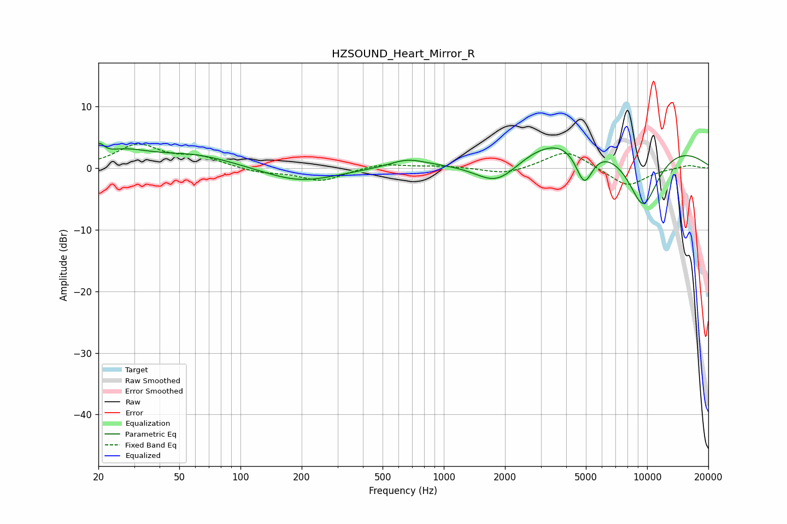

# HZSOUND_Heart_Mirror_R
See [usage instructions](https://github.com/jaakkopasanen/AutoEq#usage) for more options and info.

### Parametric EQs
Apply preamp of -4.1 dB when using parametric equalizer.

|   # | Type    |   Fc (Hz) |    Q |   Gain (dB) |
|-----|---------|-----------|------|-------------|
|   1 | Peaking |        20 | 5.96 |         2   |
|   2 | Peaking |        27 | 1.15 |         2.2 |
|   3 | Peaking |        60 | 0.69 |         2.1 |
|   4 | Peaking |       196 | 0.79 |        -2.4 |
|   5 | Peaking |       661 | 1.62 |         1.3 |
|   6 | Peaking |      1836 | 1.18 |        -5.2 |
|   7 | Peaking |      3567 | 0.78 |         1.5 |
|   8 | Peaking |      4911 | 3.19 |        -6.2 |
|   9 | Peaking |      6731 | 0.23 |         5.5 |
|  10 | Peaking |      9551 | 1.45 |       -11   |

### Fixed Band EQs
When using fixed band (also called graphic) equalizer, apply preamp of **-4.0 dB** (if available) and set gains manually with these parameters.

|   # | Type    |   Fc (Hz) |    Q |   Gain (dB) |
|-----|---------|-----------|------|-------------|
|   1 | Peaking |        31 | 1.41 |         3.6 |
|   2 | Peaking |        62 | 1.41 |         1.6 |
|   3 | Peaking |       125 | 1.41 |        -0.7 |
|   4 | Peaking |       250 | 1.41 |        -2.1 |
|   5 | Peaking |       500 | 1.41 |         0.8 |
|   6 | Peaking |      1000 | 1.41 |         0.3 |
|   7 | Peaking |      2000 | 1.41 |        -1.1 |
|   8 | Peaking |      4000 | 1.41 |         3   |
|   9 | Peaking |      8000 | 1.41 |        -3   |
|  10 | Peaking |     16000 | 1.41 |         0.5 |

### Graphs

