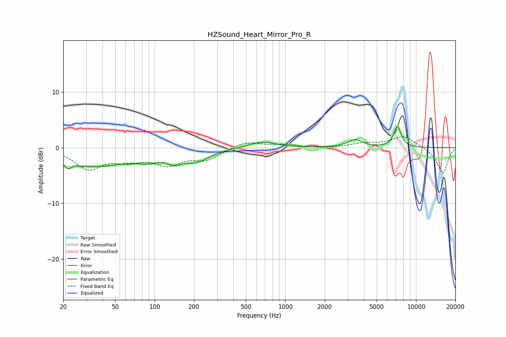

# HZSound_Heart_Mirror_Pro_R
See [usage instructions](https://github.com/jaakkopasanen/AutoEq#usage) for more options and info.

### Parametric EQs
Apply preamp of -3.9 dB when using parametric equalizer.

|   # | Type    |   Fc (Hz) |    Q |   Gain (dB) |
|-----|---------|-----------|------|-------------|
|   1 | Peaking |        22 | 5.99 |         2.5 |
|   2 | Peaking |        22 | 5.98 |        -3.6 |
|   3 | Peaking |        34 | 0.53 |        -3.3 |
|   4 | Peaking |        89 | 1.54 |        -1.2 |
|   5 | Peaking |       139 | 4.89 |         1.9 |
|   6 | Peaking |       139 | 3.73 |        -3.1 |
|   7 | Peaking |       207 | 1.4  |        -2.2 |
|   8 | Peaking |       665 | 1.43 |         1.1 |
|   9 | Peaking |      3421 | 2.57 |         1.4 |
|  10 | Peaking |      7199 | 4.76 |         3.7 |

### Fixed Band EQs
When using fixed band (also called graphic) equalizer, apply preamp of **-2.1 dB** (if available) and set gains manually with these parameters.

|   # | Type    |   Fc (Hz) |    Q |   Gain (dB) |
|-----|---------|-----------|------|-------------|
|   1 | Peaking |        31 | 1.41 |        -3.6 |
|   2 | Peaking |        62 | 1.41 |        -1.8 |
|   3 | Peaking |       125 | 1.41 |        -2.7 |
|   4 | Peaking |       250 | 1.41 |        -2   |
|   5 | Peaking |       500 | 1.41 |         1.2 |
|   6 | Peaking |      1000 | 1.41 |         0.5 |
|   7 | Peaking |      2000 | 1.41 |        -0.2 |
|   8 | Peaking |      4000 | 1.41 |         0.7 |
|   9 | Peaking |      8000 | 1.41 |         2.1 |
|  10 | Peaking |     16000 | 1.41 |        -4.7 |

### Graphs

