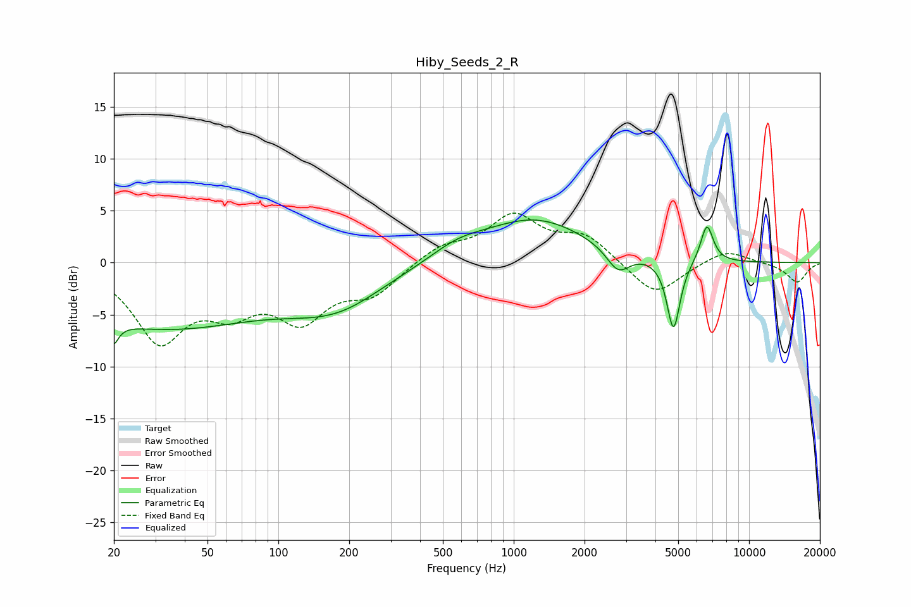

# Hiby_Seeds_2_R
See [usage instructions](https://github.com/jaakkopasanen/AutoEq#usage) for more options and info.

### Parametric EQs
Apply preamp of -4.2 dB when using parametric equalizer.

|   # | Type    |   Fc (Hz) |    Q |   Gain (dB) |
|-----|---------|-----------|------|-------------|
|   1 | Peaking |        20 | 6    |        -5.3 |
|   2 | Peaking |        20 | 5.98 |         3.2 |
|   3 | Peaking |        31 | 0.32 |        -6.1 |
|   4 | Peaking |       173 | 0.66 |        -3.5 |
|   5 | Peaking |       203 | 1.76 |        -0.1 |
|   6 | Peaking |       576 | 1.22 |         1.2 |
|   7 | Peaking |      1227 | 0.63 |         4.2 |
|   8 | Peaking |      2777 | 2.84 |        -2.2 |
|   9 | Peaking |      4775 | 4.96 |        -6.9 |
|  10 | Peaking |      6622 | 5.12 |         3.7 |

### Fixed Band EQs
When using fixed band (also called graphic) equalizer, apply preamp of **-4.9 dB** (if available) and set gains manually with these parameters.

|   # | Type    |   Fc (Hz) |    Q |   Gain (dB) |
|-----|---------|-----------|------|-------------|
|   1 | Peaking |        31 | 1.41 |        -7.1 |
|   2 | Peaking |        62 | 1.41 |        -3.6 |
|   3 | Peaking |       125 | 1.41 |        -4.9 |
|   4 | Peaking |       250 | 1.41 |        -2.7 |
|   5 | Peaking |       500 | 1.41 |         1.5 |
|   6 | Peaking |      1000 | 1.41 |         4.3 |
|   7 | Peaking |      2000 | 1.41 |         2.4 |
|   8 | Peaking |      4000 | 1.41 |        -3.3 |
|   9 | Peaking |      8000 | 1.41 |         1.3 |
|  10 | Peaking |     16000 | 1.41 |        -1.9 |

### Graphs

