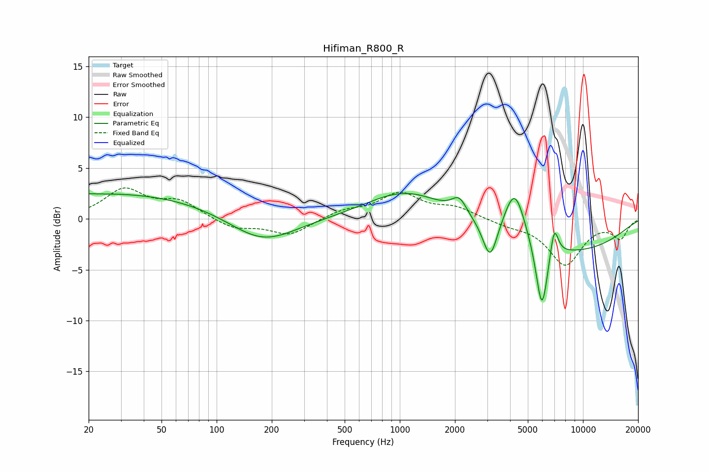

# Hifiman_R800_R
See [usage instructions](https://github.com/jaakkopasanen/AutoEq#usage) for more options and info.

### Parametric EQs
Apply preamp of -2.6 dB when using parametric equalizer.

|   # | Type    |   Fc (Hz) |    Q |   Gain (dB) |
|-----|---------|-----------|------|-------------|
|   1 | Peaking |        20 | 5.45 |         0   |
|   2 | Peaking |        28 | 0.24 |         2.5 |
|   3 | Peaking |       177 | 0.78 |        -2.7 |
|   4 | Peaking |      1082 | 0.67 |         2.8 |
|   5 | Peaking |      2112 | 3.42 |         1.6 |
|   6 | Peaking |      3111 | 3.64 |        -3.8 |
|   7 | Peaking |      4242 | 2.44 |         5   |
|   8 | Peaking |      5967 | 4.21 |        -6.9 |
|   9 | Peaking |      6964 | 5.99 |         3.1 |
|  10 | Peaking |      8311 | 0.38 |        -3.2 |

### Fixed Band EQs
When using fixed band (also called graphic) equalizer, apply preamp of **-3.1 dB** (if available) and set gains manually with these parameters.

|   # | Type    |   Fc (Hz) |    Q |   Gain (dB) |
|-----|---------|-----------|------|-------------|
|   1 | Peaking |        31 | 1.41 |         2.8 |
|   2 | Peaking |        62 | 1.41 |         1.6 |
|   3 | Peaking |       125 | 1.41 |        -1   |
|   4 | Peaking |       250 | 1.41 |        -1.6 |
|   5 | Peaking |       500 | 1.41 |         0.8 |
|   6 | Peaking |      1000 | 1.41 |         2.4 |
|   7 | Peaking |      2000 | 1.41 |         1   |
|   8 | Peaking |      4000 | 1.41 |        -0.5 |
|   9 | Peaking |      8000 | 1.41 |        -4.4 |
|  10 | Peaking |     16000 | 1.41 |        -1.8 |

### Graphs

