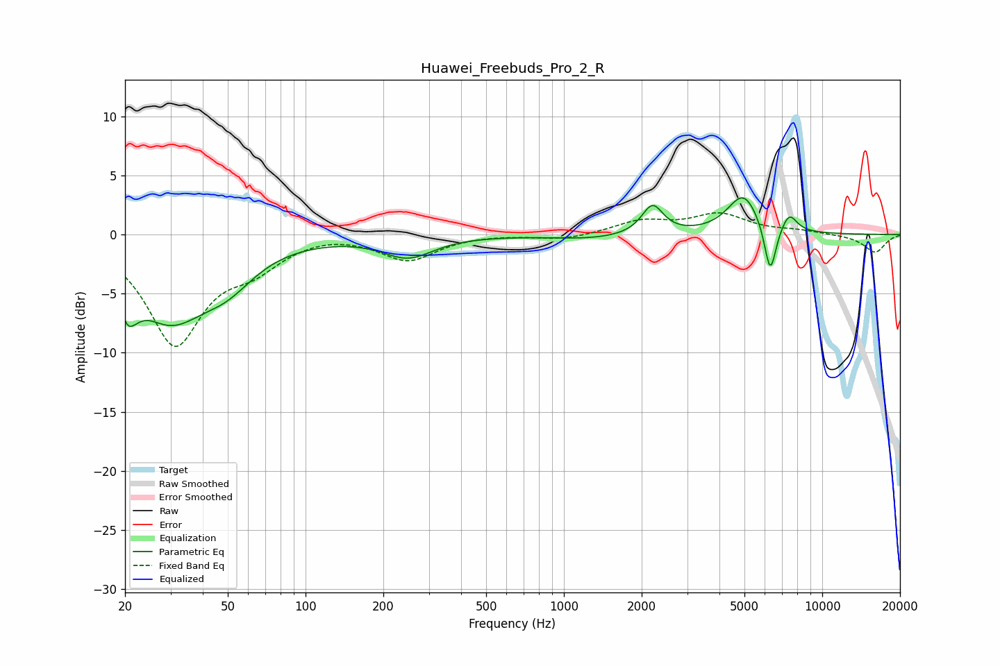

# Huawei_Freebuds_Pro_2_R
See [usage instructions](https://github.com/jaakkopasanen/AutoEq#usage) for more options and info.

### Parametric EQs
Apply preamp of -3.2 dB when using parametric equalizer.

|   # | Type    |   Fc (Hz) |    Q |   Gain (dB) |
|-----|---------|-----------|------|-------------|
|   1 | Peaking |        21 | 4.87 |        -6.4 |
|   2 | Peaking |        21 | 5.92 |         3.3 |
|   3 | Peaking |        30 | 0.97 |        -6.6 |
|   4 | Peaking |        50 | 1.31 |        -2.4 |
|   5 | Peaking |       249 | 1.45 |        -1.8 |
|   6 | Peaking |      1273 | 0.93 |        -0.4 |
|   7 | Peaking |      2203 | 3.44 |         2.5 |
|   8 | Peaking |      4954 | 2.27 |         3.4 |
|   9 | Peaking |      6290 | 6    |        -4.4 |
|  10 | Peaking |      7451 | 4.5  |         1.5 |

### Fixed Band EQs
When using fixed band (also called graphic) equalizer, apply preamp of **-1.9 dB** (if available) and set gains manually with these parameters.

|   # | Type    |   Fc (Hz) |    Q |   Gain (dB) |
|-----|---------|-----------|------|-------------|
|   1 | Peaking |        31 | 1.41 |        -9.1 |
|   2 | Peaking |        62 | 1.41 |        -2.1 |
|   3 | Peaking |       125 | 1.41 |         0.3 |
|   4 | Peaking |       250 | 1.41 |        -2.1 |
|   5 | Peaking |       500 | 1.41 |         0.1 |
|   6 | Peaking |      1000 | 1.41 |        -0.5 |
|   7 | Peaking |      2000 | 1.41 |         1.1 |
|   8 | Peaking |      4000 | 1.41 |         1.6 |
|   9 | Peaking |      8000 | 1.41 |         0.3 |
|  10 | Peaking |     16000 | 1.41 |        -1.5 |

### Graphs

