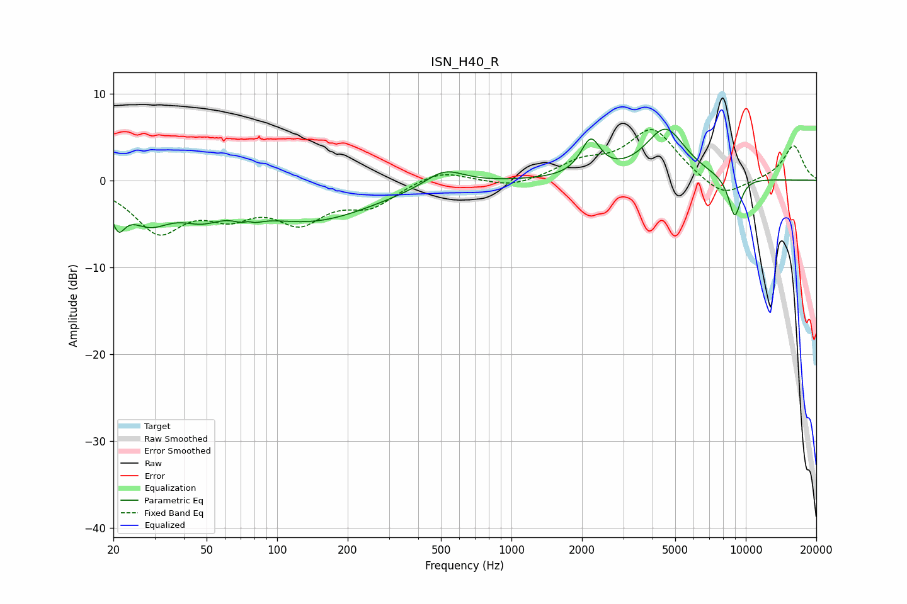

# ISN_H40_R
See [usage instructions](https://github.com/jaakkopasanen/AutoEq#usage) for more options and info.

### Parametric EQs
Apply preamp of -6.0 dB when using parametric equalizer.

|   # | Type    |   Fc (Hz) |    Q |   Gain (dB) |
|-----|---------|-----------|------|-------------|
|   1 | Peaking |        21 | 4.95 |        -3.1 |
|   2 | Peaking |        28 | 1.45 |        -3.9 |
|   3 | Peaking |        48 | 1.57 |        -2.2 |
|   4 | Peaking |        75 | 4.24 |        -4.4 |
|   5 | Peaking |        75 | 5    |         3.7 |
|   6 | Peaking |       140 | 0.52 |        -4.5 |
|   7 | Peaking |       517 | 1.68 |         2   |
|   8 | Peaking |      2179 | 3.43 |         4.1 |
|   9 | Peaking |      4543 | 1.62 |         5.8 |
|  10 | Peaking |      8974 | 4.72 |        -4.7 |

### Fixed Band EQs
When using fixed band (also called graphic) equalizer, apply preamp of **-5.9 dB** (if available) and set gains manually with these parameters.

|   # | Type    |   Fc (Hz) |    Q |   Gain (dB) |
|-----|---------|-----------|------|-------------|
|   1 | Peaking |        31 | 1.41 |        -5.6 |
|   2 | Peaking |        62 | 1.41 |        -3.1 |
|   3 | Peaking |       125 | 1.41 |        -4.2 |
|   4 | Peaking |       250 | 1.41 |        -2.6 |
|   5 | Peaking |       500 | 1.41 |         1.3 |
|   6 | Peaking |      1000 | 1.41 |        -0.9 |
|   7 | Peaking |      2000 | 1.41 |         1.8 |
|   8 | Peaking |      4000 | 1.41 |         5.8 |
|   9 | Peaking |      8000 | 1.41 |        -2.2 |
|  10 | Peaking |     16000 | 1.41 |         4   |

### Graphs

