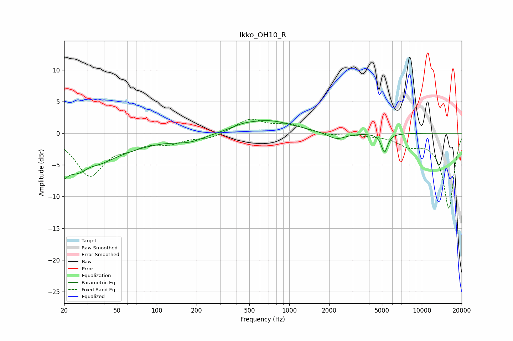

# Ikko_OH10_R
See [usage instructions](https://github.com/jaakkopasanen/AutoEq#usage) for more options and info.

### Parametric EQs
Apply preamp of -2.1 dB when using parametric equalizer.

|   # | Type    |   Fc (Hz) |    Q |   Gain (dB) |
|-----|---------|-----------|------|-------------|
|   1 | Peaking |        20 | 5.98 |         5.2 |
|   2 | Peaking |        20 | 6    |        -7   |
|   3 | Peaking |        26 | 0.9  |        -5.4 |
|   4 | Peaking |        31 | 2.11 |         1.3 |
|   5 | Peaking |        44 | 0.42 |        -1.8 |
|   6 | Peaking |       178 | 1.22 |        -1   |
|   7 | Peaking |       443 | 1.95 |         0.4 |
|   8 | Peaking |       681 | 0.73 |         2   |
|   9 | Peaking |      2270 | 2.04 |        -1.1 |
|  10 | Peaking |      5230 | 5.99 |        -3   |

### Fixed Band EQs
When using fixed band (also called graphic) equalizer, apply preamp of **-2.3 dB** (if available) and set gains manually with these parameters.

|   # | Type    |   Fc (Hz) |    Q |   Gain (dB) |
|-----|---------|-----------|------|-------------|
|   1 | Peaking |        31 | 1.41 |        -6.5 |
|   2 | Peaking |        62 | 1.41 |        -1.5 |
|   3 | Peaking |       125 | 1.41 |        -1.3 |
|   4 | Peaking |       250 | 1.41 |        -0.8 |
|   5 | Peaking |       500 | 1.41 |         2.2 |
|   6 | Peaking |      1000 | 1.41 |         1.3 |
|   7 | Peaking |      2000 | 1.41 |        -0.3 |
|   8 | Peaking |      4000 | 1.41 |        -0.2 |
|   9 | Peaking |      8000 | 1.41 |        -1.6 |
|  10 | Peaking |     16000 | 1.41 |       -11.8 |

### Graphs

