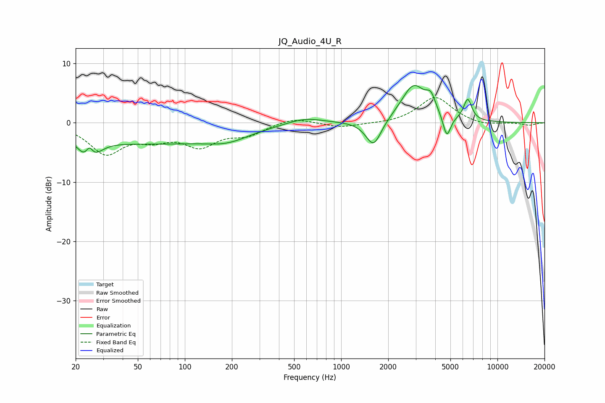

# JQ_Audio_4U_R
See [usage instructions](https://github.com/jaakkopasanen/AutoEq#usage) for more options and info.

### Parametric EQs
Apply preamp of -6.4 dB when using parametric equalizer.

|   # | Type    |   Fc (Hz) |    Q |   Gain (dB) |
|-----|---------|-----------|------|-------------|
|   1 | Peaking |        24 | 2.45 |        -4.7 |
|   2 | Peaking |        25 | 5.92 |         2.8 |
|   3 | Peaking |        61 | 0.31 |        -3.3 |
|   4 | Peaking |       188 | 1.02 |        -1.6 |
|   5 | Peaking |       585 | 1.23 |         1.1 |
|   6 | Peaking |      1612 | 2.83 |        -4.5 |
|   7 | Peaking |      2907 | 1.77 |         6.3 |
|   8 | Peaking |      3751 | 4.59 |         2.4 |
|   9 | Peaking |      4742 | 5.7  |        -3.8 |
|  10 | Peaking |      6454 | 5.3  |         3.6 |

### Fixed Band EQs
When using fixed band (also called graphic) equalizer, apply preamp of **-4.3 dB** (if available) and set gains manually with these parameters.

|   # | Type    |   Fc (Hz) |    Q |   Gain (dB) |
|-----|---------|-----------|------|-------------|
|   1 | Peaking |        31 | 1.41 |        -4.9 |
|   2 | Peaking |        62 | 1.41 |        -2.1 |
|   3 | Peaking |       125 | 1.41 |        -3.5 |
|   4 | Peaking |       250 | 1.41 |        -1.8 |
|   5 | Peaking |       500 | 1.41 |         1   |
|   6 | Peaking |      1000 | 1.41 |        -0.8 |
|   7 | Peaking |      2000 | 1.41 |        -0.2 |
|   8 | Peaking |      4000 | 1.41 |         4.4 |
|   9 | Peaking |      8000 | 1.41 |        -0.5 |
|  10 | Peaking |     16000 | 1.41 |        -0.4 |

### Graphs

