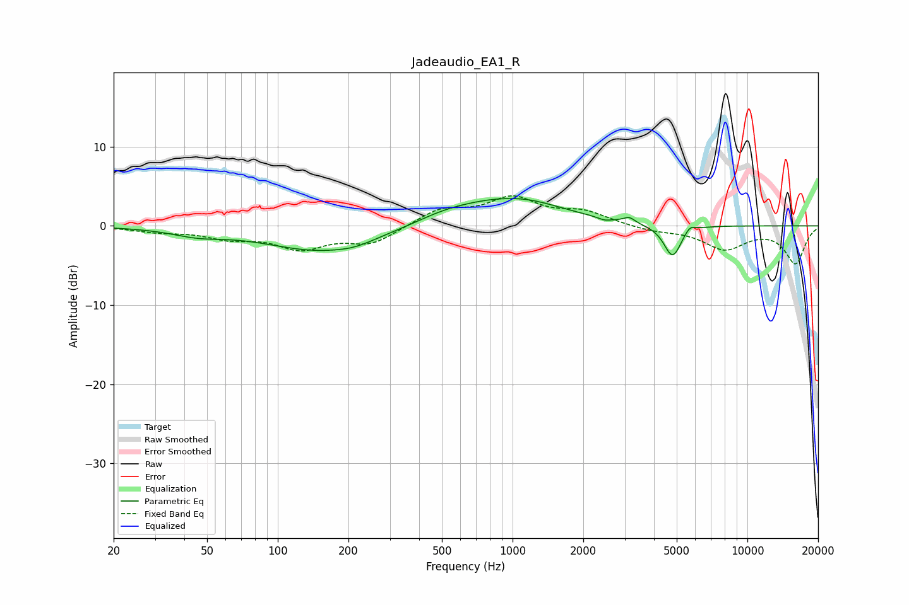

# Jadeaudio_EA1_R
See [usage instructions](https://github.com/jaakkopasanen/AutoEq#usage) for more options and info.

### Parametric EQs
Apply preamp of -3.6 dB when using parametric equalizer.

|   # | Type    |   Fc (Hz) |    Q |   Gain (dB) |
|-----|---------|-----------|------|-------------|
|   1 | Peaking |        46 | 1.27 |        -0.9 |
|   2 | Peaking |       152 | 0.6  |        -3.1 |
|   3 | Peaking |       213 | 1.82 |        -0.4 |
|   4 | Peaking |       511 | 1.13 |         0.9 |
|   5 | Peaking |       940 | 1.34 |        -0.5 |
|   6 | Peaking |       975 | 0.71 |         4   |
|   7 | Peaking |      2461 | 5.31 |        -0.3 |
|   8 | Peaking |      3138 | 5.99 |         0.7 |
|   9 | Peaking |      4803 | 3.78 |        -4.1 |
|  10 | Peaking |      5681 | 6    |         0.8 |

### Fixed Band EQs
When using fixed band (also called graphic) equalizer, apply preamp of **-3.9 dB** (if available) and set gains manually with these parameters.

|   # | Type    |   Fc (Hz) |    Q |   Gain (dB) |
|-----|---------|-----------|------|-------------|
|   1 | Peaking |        31 | 1.41 |        -0.6 |
|   2 | Peaking |        62 | 1.41 |        -1.3 |
|   3 | Peaking |       125 | 1.41 |        -2.6 |
|   4 | Peaking |       250 | 1.41 |        -2.1 |
|   5 | Peaking |       500 | 1.41 |         2   |
|   6 | Peaking |      1000 | 1.41 |         3.3 |
|   7 | Peaking |      2000 | 1.41 |         1.6 |
|   8 | Peaking |      4000 | 1.41 |        -0.6 |
|   9 | Peaking |      8000 | 1.41 |        -2.8 |
|  10 | Peaking |     16000 | 1.41 |        -4.7 |

### Graphs

