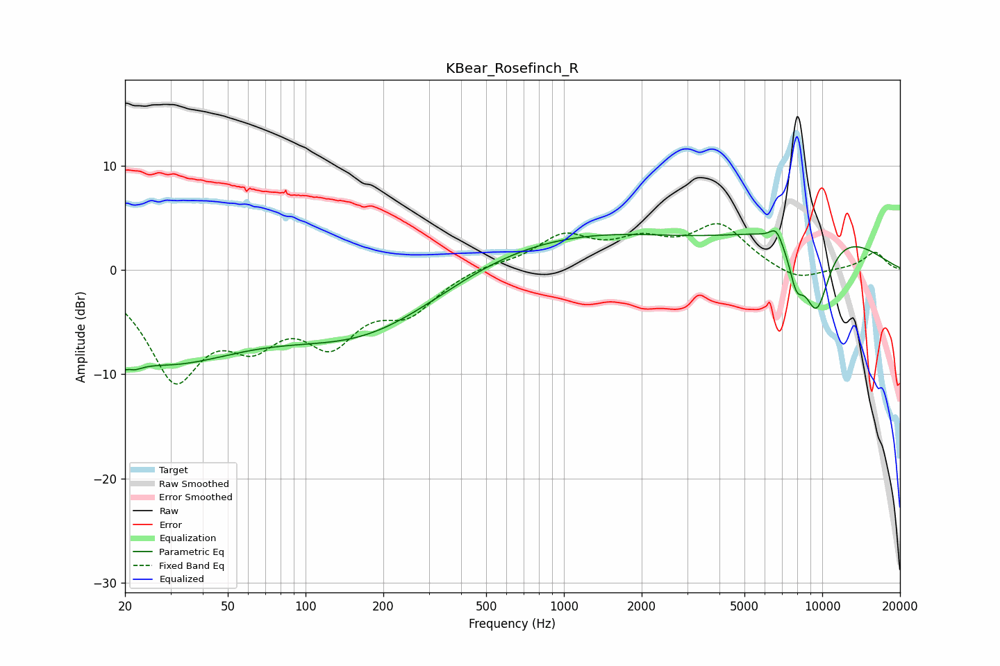

# KBear_Rosefinch_R
See [usage instructions](https://github.com/jaakkopasanen/AutoEq#usage) for more options and info.

### Parametric EQs
Apply preamp of -3.9 dB when using parametric equalizer.

|   # | Type    |   Fc (Hz) |    Q |   Gain (dB) |
|-----|---------|-----------|------|-------------|
|   1 | Peaking |        20 | 4.35 |        -4.9 |
|   2 | Peaking |        20 | 5.64 |         3.3 |
|   3 | Peaking |        27 | 0.43 |        -8   |
|   4 | Peaking |       173 | 0.43 |        -6.1 |
|   5 | Peaking |       984 | 0.31 |         3.8 |
|   6 | Peaking |       994 | 0.81 |        -0.1 |
|   7 | Peaking |      6632 | 5.49 |         1.3 |
|   8 | Peaking |      7937 | 4.5  |        -3.3 |
|   9 | Peaking |      9082 | 0.47 |         4.6 |
|  10 | Peaking |      9485 | 2.24 |        -7.9 |

### Fixed Band EQs
When using fixed band (also called graphic) equalizer, apply preamp of **-4.5 dB** (if available) and set gains manually with these parameters.

|   # | Type    |   Fc (Hz) |    Q |   Gain (dB) |
|-----|---------|-----------|------|-------------|
|   1 | Peaking |        31 | 1.41 |        -9.7 |
|   2 | Peaking |        62 | 1.41 |        -5.1 |
|   3 | Peaking |       125 | 1.41 |        -5.9 |
|   4 | Peaking |       250 | 1.41 |        -3.5 |
|   5 | Peaking |       500 | 1.41 |         0.5 |
|   6 | Peaking |      1000 | 1.41 |         3.1 |
|   7 | Peaking |      2000 | 1.41 |         2.3 |
|   8 | Peaking |      4000 | 1.41 |         4.1 |
|   9 | Peaking |      8000 | 1.41 |        -1.2 |
|  10 | Peaking |     16000 | 1.41 |         1.7 |

### Graphs

