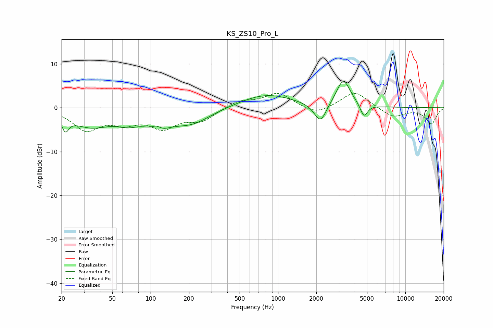

# KS_ZS10_Pro_L
See [usage instructions](https://github.com/jaakkopasanen/AutoEq#usage) for more options and info.

### Parametric EQs
Apply preamp of -6.0 dB when using parametric equalizer.

|   # | Type    |   Fc (Hz) |    Q |   Gain (dB) |
|-----|---------|-----------|------|-------------|
|   1 | Peaking |        21 | 5.37 |        -3   |
|   2 | Peaking |        34 | 0.87 |        -4   |
|   3 | Peaking |        66 | 1.67 |        -1.9 |
|   4 | Peaking |       111 | 3.21 |         2.7 |
|   5 | Peaking |       112 | 1.86 |        -4.6 |
|   6 | Peaking |       207 | 0.9  |        -3.5 |
|   7 | Peaking |       810 | 0.67 |         3.1 |
|   8 | Peaking |      2153 | 2.93 |        -4.6 |
|   9 | Peaking |      3255 | 2.51 |         6.3 |
|  10 | Peaking |      4725 | 4.96 |        -3   |

### Fixed Band EQs
When using fixed band (also called graphic) equalizer, apply preamp of **-3.3 dB** (if available) and set gains manually with these parameters.

|   # | Type    |   Fc (Hz) |    Q |   Gain (dB) |
|-----|---------|-----------|------|-------------|
|   1 | Peaking |        31 | 1.41 |        -4.8 |
|   2 | Peaking |        62 | 1.41 |        -2.7 |
|   3 | Peaking |       125 | 1.41 |        -4.1 |
|   4 | Peaking |       250 | 1.41 |        -2.7 |
|   5 | Peaking |       500 | 1.41 |         1.6 |
|   6 | Peaking |      1000 | 1.41 |         3.3 |
|   7 | Peaking |      2000 | 1.41 |        -1.8 |
|   8 | Peaking |      4000 | 1.41 |         3.8 |
|   9 | Peaking |      8000 | 1.41 |        -2.2 |
|  10 | Peaking |     16000 | 1.41 |        -3.6 |

### Graphs

