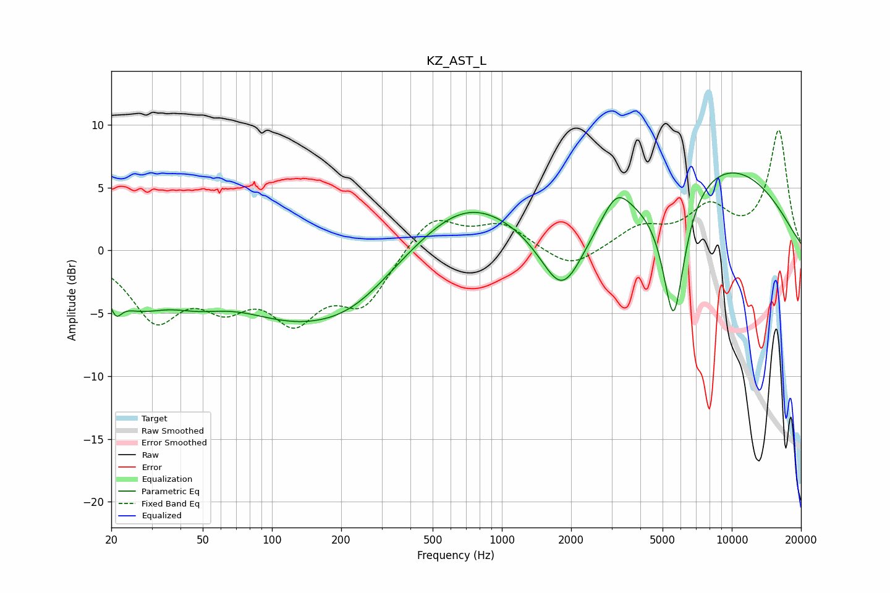

# KZ_AST_L
See [usage instructions](https://github.com/jaakkopasanen/AutoEq#usage) for more options and info.

### Parametric EQs
Apply preamp of -6.3 dB when using parametric equalizer.

|   # | Type    |   Fc (Hz) |    Q |   Gain (dB) |
|-----|---------|-----------|------|-------------|
|   1 | Peaking |        21 | 5.67 |        -1.6 |
|   2 | Peaking |        26 | 1.06 |        -3.3 |
|   3 | Peaking |        47 | 1.08 |        -1.6 |
|   4 | Peaking |       122 | 0.52 |        -4.5 |
|   5 | Peaking |       229 | 0.77 |        -2.3 |
|   6 | Peaking |       708 | 0.63 |         4   |
|   7 | Peaking |      1831 | 1.5  |        -5.4 |
|   8 | Peaking |      3152 | 2.27 |         2.4 |
|   9 | Peaking |      5581 | 2.78 |       -11   |
|  10 | Peaking |      8486 | 0.36 |         7   |

### Fixed Band EQs
When using fixed band (also called graphic) equalizer, apply preamp of **-9.6 dB** (if available) and set gains manually with these parameters.

|   # | Type    |   Fc (Hz) |    Q |   Gain (dB) |
|-----|---------|-----------|------|-------------|
|   1 | Peaking |        31 | 1.41 |        -5.1 |
|   2 | Peaking |        62 | 1.41 |        -3.4 |
|   3 | Peaking |       125 | 1.41 |        -4.8 |
|   4 | Peaking |       250 | 1.41 |        -4   |
|   5 | Peaking |       500 | 1.41 |         2.9 |
|   6 | Peaking |      1000 | 1.41 |         2   |
|   7 | Peaking |      2000 | 1.41 |        -1.6 |
|   8 | Peaking |      4000 | 1.41 |         1.7 |
|   9 | Peaking |      8000 | 1.41 |         3.1 |
|  10 | Peaking |     16000 | 1.41 |         9.5 |

### Graphs

