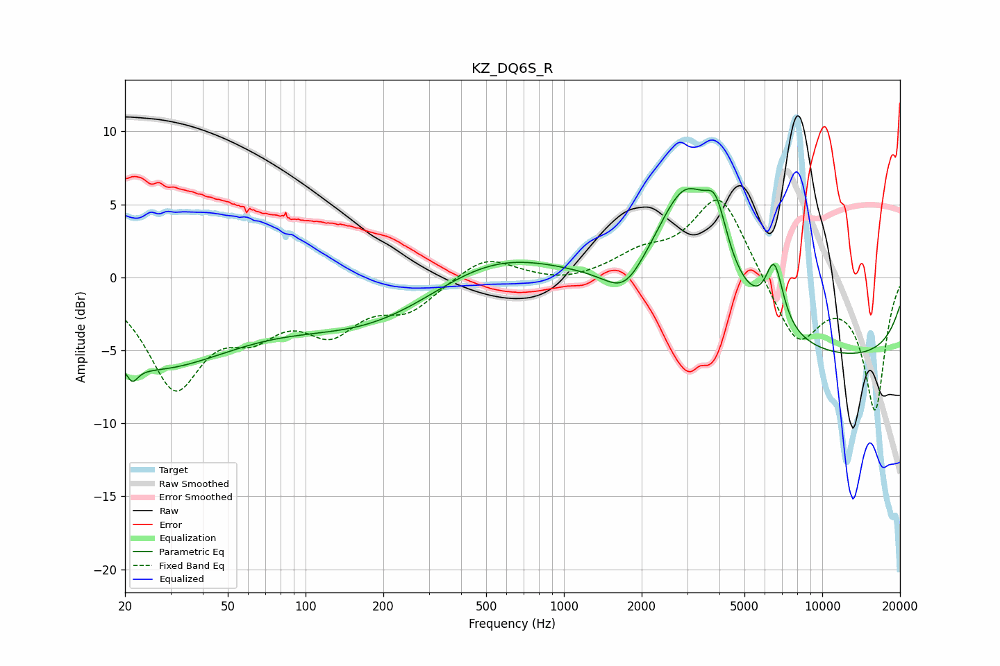

# KZ_DQ6S_R
See [usage instructions](https://github.com/jaakkopasanen/AutoEq#usage) for more options and info.

### Parametric EQs
Apply preamp of -6.2 dB when using parametric equalizer.

|   # | Type    |   Fc (Hz) |    Q |   Gain (dB) |
|-----|---------|-----------|------|-------------|
|   1 | Peaking |        21 | 5.44 |         3.4 |
|   2 | Peaking |        21 | 5.67 |        -4.4 |
|   3 | Peaking |        25 | 0.42 |        -5.9 |
|   4 | Peaking |       186 | 0.44 |        -3.4 |
|   5 | Peaking |       507 | 0.54 |         2.5 |
|   6 | Peaking |      1722 | 1.79 |        -2.1 |
|   7 | Peaking |      2969 | 1.09 |         9.2 |
|   8 | Peaking |      3878 | 3.27 |         3.4 |
|   9 | Peaking |      6524 | 3.92 |         4.2 |
|  10 | Peaking |     10000 | 0.18 |        -5.7 |

### Fixed Band EQs
When using fixed band (also called graphic) equalizer, apply preamp of **-5.4 dB** (if available) and set gains manually with these parameters.

|   # | Type    |   Fc (Hz) |    Q |   Gain (dB) |
|-----|---------|-----------|------|-------------|
|   1 | Peaking |        31 | 1.41 |        -7.2 |
|   2 | Peaking |        62 | 1.41 |        -2.8 |
|   3 | Peaking |       125 | 1.41 |        -3.2 |
|   4 | Peaking |       250 | 1.41 |        -2   |
|   5 | Peaking |       500 | 1.41 |         1.6 |
|   6 | Peaking |      1000 | 1.41 |        -0.4 |
|   7 | Peaking |      2000 | 1.41 |         1.4 |
|   8 | Peaking |      4000 | 1.41 |         5.8 |
|   9 | Peaking |      8000 | 1.41 |        -4.6 |
|  10 | Peaking |     16000 | 1.41 |        -9   |

### Graphs

