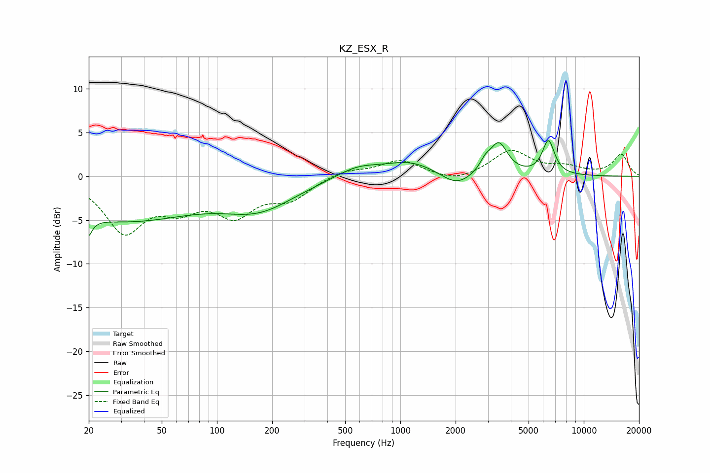

# KZ_ESX_R
See [usage instructions](https://github.com/jaakkopasanen/AutoEq#usage) for more options and info.

### Parametric EQs
Apply preamp of -4.2 dB when using parametric equalizer.

|   # | Type    |   Fc (Hz) |    Q |   Gain (dB) |
|-----|---------|-----------|------|-------------|
|   1 | Peaking |        20 | 5.86 |        -5.4 |
|   2 | Peaking |        20 | 5.93 |         3.3 |
|   3 | Peaking |        30 | 0.34 |        -4.9 |
|   4 | Peaking |       171 | 0.72 |        -3.1 |
|   5 | Peaking |       584 | 1.19 |         1.2 |
|   6 | Peaking |      1130 | 1    |         1.6 |
|   7 | Peaking |      2026 | 1.69 |        -1.6 |
|   8 | Peaking |      2899 | 4.71 |         1   |
|   9 | Peaking |      3439 | 2.89 |         3.6 |
|  10 | Peaking |      6417 | 4.14 |         3.9 |

### Fixed Band EQs
When using fixed band (also called graphic) equalizer, apply preamp of **-3.0 dB** (if available) and set gains manually with these parameters.

|   # | Type    |   Fc (Hz) |    Q |   Gain (dB) |
|-----|---------|-----------|------|-------------|
|   1 | Peaking |        31 | 1.41 |        -6   |
|   2 | Peaking |        62 | 1.41 |        -2.8 |
|   3 | Peaking |       125 | 1.41 |        -3.9 |
|   4 | Peaking |       250 | 1.41 |        -2.3 |
|   5 | Peaking |       500 | 1.41 |         0.8 |
|   6 | Peaking |      1000 | 1.41 |         1.8 |
|   7 | Peaking |      2000 | 1.41 |        -0.8 |
|   8 | Peaking |      4000 | 1.41 |         2.9 |
|   9 | Peaking |      8000 | 1.41 |         0.9 |
|  10 | Peaking |     16000 | 1.41 |         2.5 |

### Graphs

