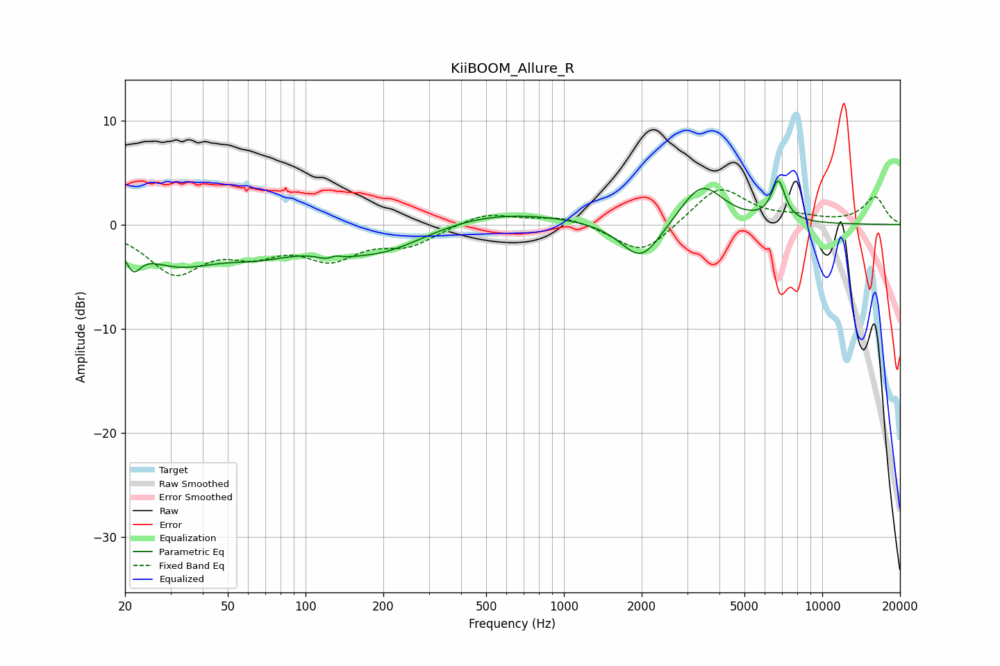

# KiiBOOM_Allure_R
See [usage instructions](https://github.com/jaakkopasanen/AutoEq#usage) for more options and info.

### Parametric EQs
Apply preamp of -4.3 dB when using parametric equalizer.

|   # | Type    |   Fc (Hz) |    Q |   Gain (dB) |
|-----|---------|-----------|------|-------------|
|   1 | Peaking |        22 | 5.11 |        -2.1 |
|   2 | Peaking |        32 | 0.9  |        -3.3 |
|   3 | Peaking |        66 | 0.93 |        -1.8 |
|   4 | Peaking |       129 | 3.8  |        -3.1 |
|   5 | Peaking |       129 | 4.46 |         2.7 |
|   6 | Peaking |       195 | 0.71 |        -3.1 |
|   7 | Peaking |       482 | 0.47 |         1.6 |
|   8 | Peaking |      1993 | 1.79 |        -3.9 |
|   9 | Peaking |      3413 | 1.69 |         4   |
|  10 | Peaking |      6760 | 5.07 |         3.8 |

### Fixed Band EQs
When using fixed band (also called graphic) equalizer, apply preamp of **-3.4 dB** (if available) and set gains manually with these parameters.

|   # | Type    |   Fc (Hz) |    Q |   Gain (dB) |
|-----|---------|-----------|------|-------------|
|   1 | Peaking |        31 | 1.41 |        -4.4 |
|   2 | Peaking |        62 | 1.41 |        -2.1 |
|   3 | Peaking |       125 | 1.41 |        -2.9 |
|   4 | Peaking |       250 | 1.41 |        -1.8 |
|   5 | Peaking |       500 | 1.41 |         1.2 |
|   6 | Peaking |      1000 | 1.41 |         0.8 |
|   7 | Peaking |      2000 | 1.41 |        -3   |
|   8 | Peaking |      4000 | 1.41 |         3.7 |
|   9 | Peaking |      8000 | 1.41 |         0.5 |
|  10 | Peaking |     16000 | 1.41 |         2.6 |

### Graphs

