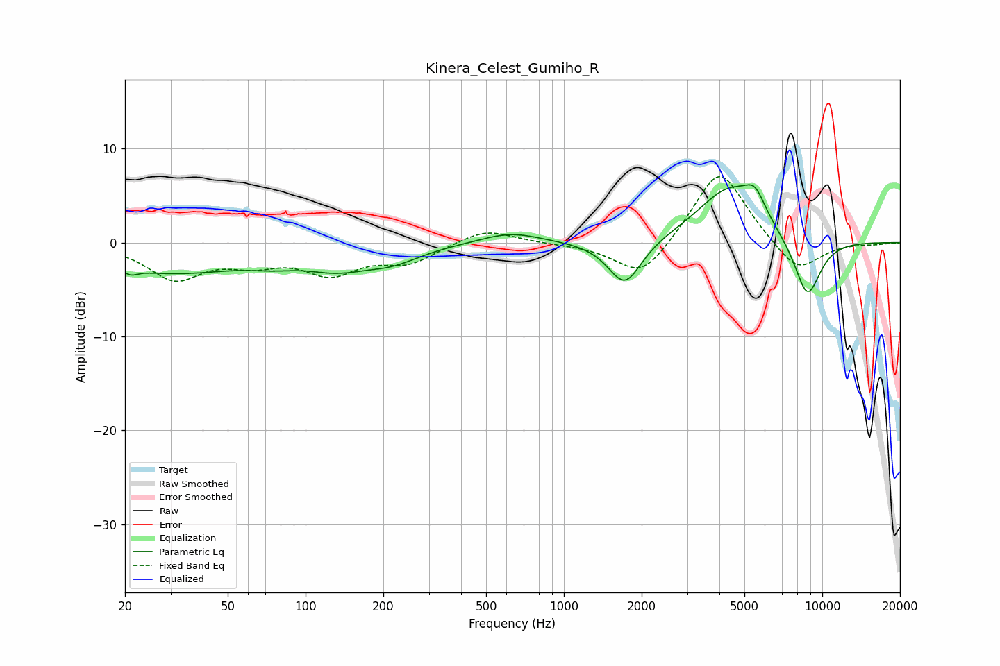

# Kinera_Celest_Gumiho_R
See [usage instructions](https://github.com/jaakkopasanen/AutoEq#usage) for more options and info.

### Parametric EQs
Apply preamp of -6.2 dB when using parametric equalizer.

|   # | Type    |   Fc (Hz) |    Q |   Gain (dB) |
|-----|---------|-----------|------|-------------|
|   1 | Peaking |        21 | 5.57 |        -0.6 |
|   2 | Peaking |        30 | 0.49 |        -3.1 |
|   3 | Peaking |        76 | 1.42 |        -0.8 |
|   4 | Peaking |       131 | 1.17 |        -1.9 |
|   5 | Peaking |       215 | 1.22 |        -1.6 |
|   6 | Peaking |       620 | 1.23 |         1.2 |
|   7 | Peaking |      1723 | 2.16 |        -4.9 |
|   8 | Peaking |      4375 | 1.12 |         5.8 |
|   9 | Peaking |      5494 | 3.48 |         2.4 |
|  10 | Peaking |      8758 | 2.41 |        -6.5 |

### Fixed Band EQs
When using fixed band (also called graphic) equalizer, apply preamp of **-7.1 dB** (if available) and set gains manually with these parameters.

|   # | Type    |   Fc (Hz) |    Q |   Gain (dB) |
|-----|---------|-----------|------|-------------|
|   1 | Peaking |        31 | 1.41 |        -3.7 |
|   2 | Peaking |        62 | 1.41 |        -1.7 |
|   3 | Peaking |       125 | 1.41 |        -3   |
|   4 | Peaking |       250 | 1.41 |        -2   |
|   5 | Peaking |       500 | 1.41 |         1.6 |
|   6 | Peaking |      1000 | 1.41 |        -0.1 |
|   7 | Peaking |      2000 | 1.41 |        -4   |
|   8 | Peaking |      4000 | 1.41 |         8.2 |
|   9 | Peaking |      8000 | 1.41 |        -3.5 |
|  10 | Peaking |     16000 | 1.41 |        -0.2 |

### Graphs

