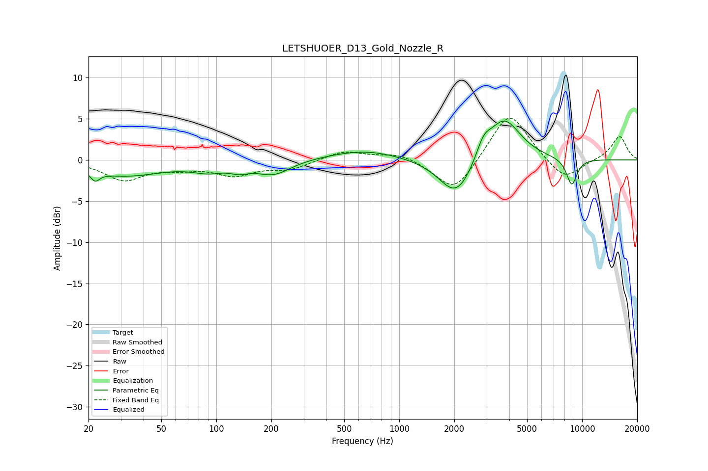

# LETSHUOER_D13_Gold_Nozzle_R
See [usage instructions](https://github.com/jaakkopasanen/AutoEq#usage) for more options and info.

### Parametric EQs
Apply preamp of -4.8 dB when using parametric equalizer.

|   # | Type    |   Fc (Hz) |    Q |   Gain (dB) |
|-----|---------|-----------|------|-------------|
|   1 | Peaking |        22 | 5.83 |        -1.1 |
|   2 | Peaking |        32 | 0.67 |        -1.9 |
|   3 | Peaking |        90 | 1.59 |        -1   |
|   4 | Peaking |       134 | 2.81 |        -0.7 |
|   5 | Peaking |       206 | 1.52 |        -1.7 |
|   6 | Peaking |       646 | 0.72 |         1.2 |
|   7 | Peaking |      2054 | 1.51 |        -4.9 |
|   8 | Peaking |      2889 | 3.58 |         2   |
|   9 | Peaking |      3734 | 1.55 |         5.3 |
|  10 | Peaking |      8776 | 4.36 |        -3.3 |

### Fixed Band EQs
When using fixed band (also called graphic) equalizer, apply preamp of **-5.2 dB** (if available) and set gains manually with these parameters.

|   # | Type    |   Fc (Hz) |    Q |   Gain (dB) |
|-----|---------|-----------|------|-------------|
|   1 | Peaking |        31 | 1.41 |        -2.3 |
|   2 | Peaking |        62 | 1.41 |        -0.8 |
|   3 | Peaking |       125 | 1.41 |        -1.7 |
|   4 | Peaking |       250 | 1.41 |        -1.1 |
|   5 | Peaking |       500 | 1.41 |         1.1 |
|   6 | Peaking |      1000 | 1.41 |         0.9 |
|   7 | Peaking |      2000 | 1.41 |        -4.1 |
|   8 | Peaking |      4000 | 1.41 |         6.1 |
|   9 | Peaking |      8000 | 1.41 |        -2.7 |
|  10 | Peaking |     16000 | 1.41 |         2.9 |

### Graphs

