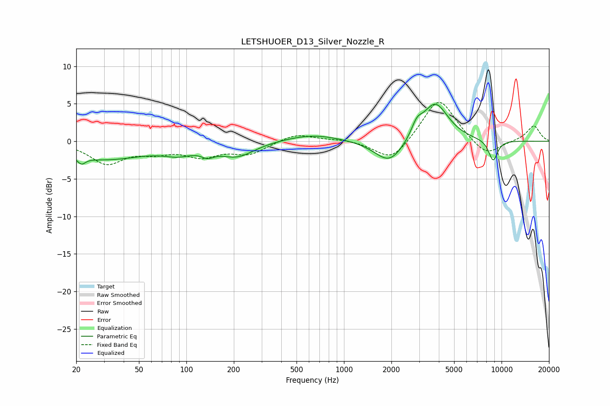

# LETSHUOER_D13_Silver_Nozzle_R
See [usage instructions](https://github.com/jaakkopasanen/AutoEq#usage) for more options and info.

### Parametric EQs
Apply preamp of -5.0 dB when using parametric equalizer.

|   # | Type    |   Fc (Hz) |    Q |   Gain (dB) |
|-----|---------|-----------|------|-------------|
|   1 | Peaking |        22 | 5.69 |        -0.9 |
|   2 | Peaking |        30 | 0.53 |        -2.3 |
|   3 | Peaking |        89 | 1.54 |        -1   |
|   4 | Peaking |       136 | 3.59 |        -0.8 |
|   5 | Peaking |       210 | 1.29 |        -1.9 |
|   6 | Peaking |       633 | 0.81 |         1   |
|   7 | Peaking |      1949 | 1.52 |        -3.2 |
|   8 | Peaking |      2898 | 4.15 |         1.6 |
|   9 | Peaking |      3784 | 1.68 |         5.2 |
|  10 | Peaking |      8843 | 4.44 |        -2.8 |

### Fixed Band EQs
When using fixed band (also called graphic) equalizer, apply preamp of **-5.3 dB** (if available) and set gains manually with these parameters.

|   # | Type    |   Fc (Hz) |    Q |   Gain (dB) |
|-----|---------|-----------|------|-------------|
|   1 | Peaking |        31 | 1.41 |        -2.8 |
|   2 | Peaking |        62 | 1.41 |        -1.1 |
|   3 | Peaking |       125 | 1.41 |        -1.8 |
|   4 | Peaking |       250 | 1.41 |        -1.6 |
|   5 | Peaking |       500 | 1.41 |         1.1 |
|   6 | Peaking |      1000 | 1.41 |         0.3 |
|   7 | Peaking |      2000 | 1.41 |        -2.8 |
|   8 | Peaking |      4000 | 1.41 |         5.9 |
|   9 | Peaking |      8000 | 1.41 |        -2.2 |
|  10 | Peaking |     16000 | 1.41 |         2.1 |

### Graphs

