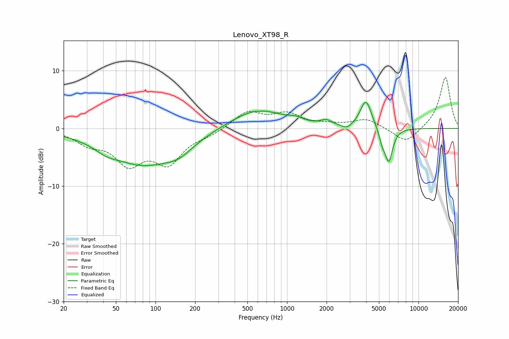

# Lenovo_XT98_R
See [usage instructions](https://github.com/jaakkopasanen/AutoEq#usage) for more options and info.

### Parametric EQs
Apply preamp of -4.6 dB when using parametric equalizer.

|   # | Type    |   Fc (Hz) |    Q |   Gain (dB) |
|-----|---------|-----------|------|-------------|
|   1 | Peaking |        42 | 1.86 |        -0.8 |
|   2 | Peaking |        81 | 0.51 |        -6.2 |
|   3 | Peaking |       150 | 1.48 |        -1.5 |
|   4 | Peaking |       591 | 0.68 |         3.4 |
|   5 | Peaking |      1168 | 3.05 |         0.5 |
|   6 | Peaking |      1989 | 3.59 |         0.9 |
|   7 | Peaking |      2857 | 3.8  |        -0.8 |
|   8 | Peaking |      3979 | 3.3  |         4.9 |
|   9 | Peaking |      5290 | 6    |        -1.9 |
|  10 | Peaking |      5944 | 4.64 |        -5.8 |

### Fixed Band EQs
When using fixed band (also called graphic) equalizer, apply preamp of **-8.9 dB** (if available) and set gains manually with these parameters.

|   # | Type    |   Fc (Hz) |    Q |   Gain (dB) |
|-----|---------|-----------|------|-------------|
|   1 | Peaking |        31 | 1.41 |        -2.2 |
|   2 | Peaking |        62 | 1.41 |        -5.5 |
|   3 | Peaking |       125 | 1.41 |        -5.5 |
|   4 | Peaking |       250 | 1.41 |        -0.9 |
|   5 | Peaking |       500 | 1.41 |         2.8 |
|   6 | Peaking |      1000 | 1.41 |         2.3 |
|   7 | Peaking |      2000 | 1.41 |         0.5 |
|   8 | Peaking |      4000 | 1.41 |         1.6 |
|   9 | Peaking |      8000 | 1.41 |        -2.7 |
|  10 | Peaking |     16000 | 1.41 |         9   |

### Graphs

