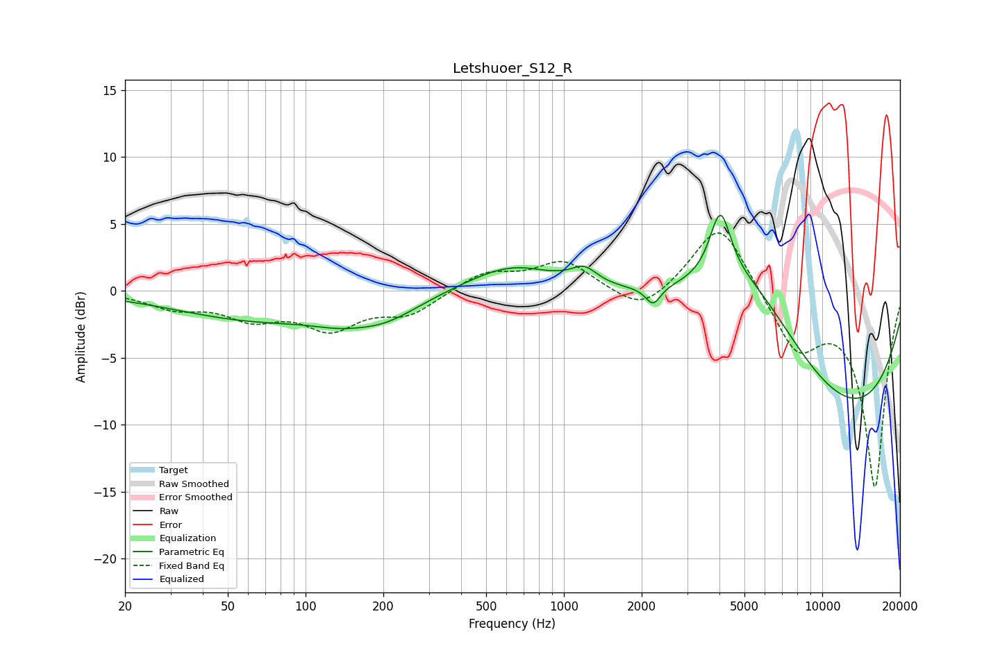

# Letshuoer_S12_R
See [usage instructions](https://github.com/jaakkopasanen/AutoEq#usage) for more options and info.

### Parametric EQs
Apply preamp of -5.7 dB when using parametric equalizer.

|   # | Type    |   Fc (Hz) |    Q |   Gain (dB) |
|-----|---------|-----------|------|-------------|
|   1 | Peaking |        66 | 0.44 |        -2.1 |
|   2 | Peaking |       133 | 1.33 |        -0.6 |
|   3 | Peaking |       201 | 1.01 |        -1.6 |
|   4 | Peaking |       632 | 0.81 |         2   |
|   5 | Peaking |       830 | 3.46 |        -0   |
|   6 | Peaking |      1200 | 2.87 |         1.2 |
|   7 | Peaking |      2214 | 4.87 |        -1.4 |
|   8 | Peaking |      4033 | 3.47 |         5   |
|   9 | Peaking |      5204 | 0.56 |         8.8 |
|  10 | Peaking |     10000 | 0.26 |       -11.1 |

### Fixed Band EQs
When using fixed band (also called graphic) equalizer, apply preamp of **-4.4 dB** (if available) and set gains manually with these parameters.

|   # | Type    |   Fc (Hz) |    Q |   Gain (dB) |
|-----|---------|-----------|------|-------------|
|   1 | Peaking |        31 | 1.41 |        -1.1 |
|   2 | Peaking |        62 | 1.41 |        -1.8 |
|   3 | Peaking |       125 | 1.41 |        -2.6 |
|   4 | Peaking |       250 | 1.41 |        -1.6 |
|   5 | Peaking |       500 | 1.41 |         1.4 |
|   6 | Peaking |      1000 | 1.41 |         2.2 |
|   7 | Peaking |      2000 | 1.41 |        -1.9 |
|   8 | Peaking |      4000 | 1.41 |         5.4 |
|   9 | Peaking |      8000 | 1.41 |        -4.3 |
|  10 | Peaking |     16000 | 1.41 |       -14.6 |

### Graphs

