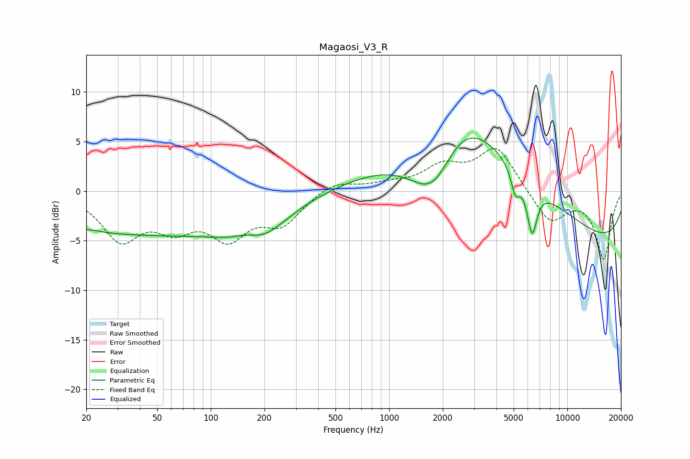

# Magaosi_V3_R
See [usage instructions](https://github.com/jaakkopasanen/AutoEq#usage) for more options and info.

### Parametric EQs
Apply preamp of -5.4 dB when using parametric equalizer.

|   # | Type    |   Fc (Hz) |    Q |   Gain (dB) |
|-----|---------|-----------|------|-------------|
|   1 | Peaking |        22 | 5.14 |         0.1 |
|   2 | Peaking |        41 | 0.2  |        -4.3 |
|   3 | Peaking |       164 | 1.51 |         2.4 |
|   4 | Peaking |       175 | 1.03 |        -4.5 |
|   5 | Peaking |      1793 | 0.91 |        -9.4 |
|   6 | Peaking |      2393 | 0.5  |        13.3 |
|   7 | Peaking |      5116 | 5.41 |        -2.4 |
|   8 | Peaking |      5793 | 0.32 |         2.5 |
|   9 | Peaking |      6338 | 4.84 |        -5   |
|  10 | Peaking |     10000 | 0.18 |        -6.2 |

### Fixed Band EQs
When using fixed band (also called graphic) equalizer, apply preamp of **-4.4 dB** (if available) and set gains manually with these parameters.

|   # | Type    |   Fc (Hz) |    Q |   Gain (dB) |
|-----|---------|-----------|------|-------------|
|   1 | Peaking |        31 | 1.41 |        -4.6 |
|   2 | Peaking |        62 | 1.41 |        -3   |
|   3 | Peaking |       125 | 1.41 |        -4.1 |
|   4 | Peaking |       250 | 1.41 |        -3   |
|   5 | Peaking |       500 | 1.41 |         1.1 |
|   6 | Peaking |      1000 | 1.41 |         0.5 |
|   7 | Peaking |      2000 | 1.41 |         2.2 |
|   8 | Peaking |      4000 | 1.41 |         4.4 |
|   9 | Peaking |      8000 | 1.41 |        -3.2 |
|  10 | Peaking |     16000 | 1.41 |        -6.8 |

### Graphs

