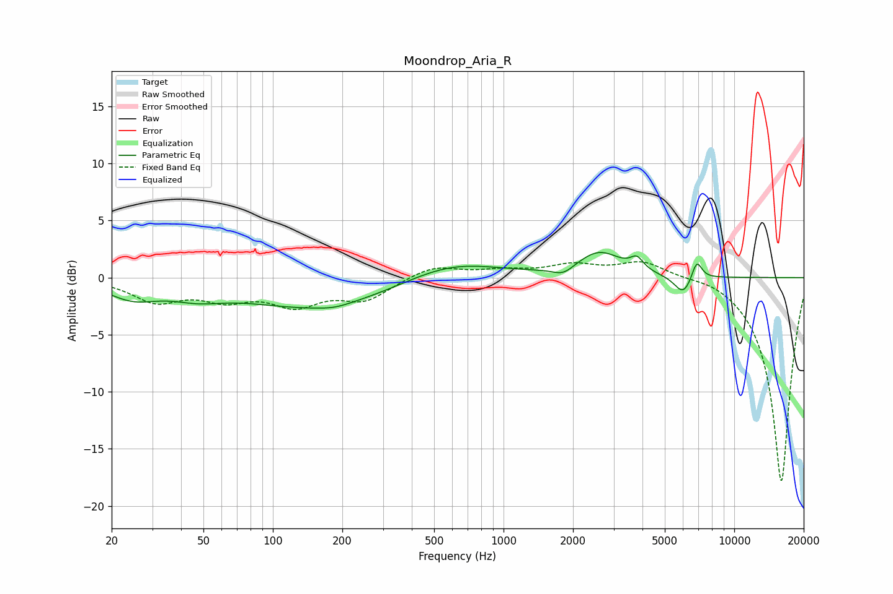

# Moondrop_Aria_R
See [usage instructions](https://github.com/jaakkopasanen/AutoEq#usage) for more options and info.

### Parametric EQs
Apply preamp of -2.3 dB when using parametric equalizer.

|   # | Type    |   Fc (Hz) |    Q |   Gain (dB) |
|-----|---------|-----------|------|-------------|
|   1 | Peaking |        25 | 1.28 |        -1.5 |
|   2 | Peaking |        47 | 1.21 |        -1   |
|   3 | Peaking |       158 | 0.43 |        -2.7 |
|   4 | Peaking |       184 | 2.13 |        -0.2 |
|   5 | Peaking |       588 | 0.68 |         1.7 |
|   6 | Peaking |      1818 | 3.08 |        -0.7 |
|   7 | Peaking |      2600 | 1.49 |         2.2 |
|   8 | Peaking |      3786 | 5    |         1   |
|   9 | Peaking |      6023 | 3.54 |        -1.7 |
|  10 | Peaking |      6873 | 6    |         1.8 |

### Fixed Band EQs
When using fixed band (also called graphic) equalizer, apply preamp of **-1.5 dB** (if available) and set gains manually with these parameters.

|   # | Type    |   Fc (Hz) |    Q |   Gain (dB) |
|-----|---------|-----------|------|-------------|
|   1 | Peaking |        31 | 1.41 |        -1.9 |
|   2 | Peaking |        62 | 1.41 |        -1.6 |
|   3 | Peaking |       125 | 1.41 |        -2.1 |
|   4 | Peaking |       250 | 1.41 |        -1.8 |
|   5 | Peaking |       500 | 1.41 |         1.1 |
|   6 | Peaking |      1000 | 1.41 |         0.5 |
|   7 | Peaking |      2000 | 1.41 |         1   |
|   8 | Peaking |      4000 | 1.41 |         1.4 |
|   9 | Peaking |      8000 | 1.41 |         0.4 |
|  10 | Peaking |     16000 | 1.41 |       -18   |

### Graphs

