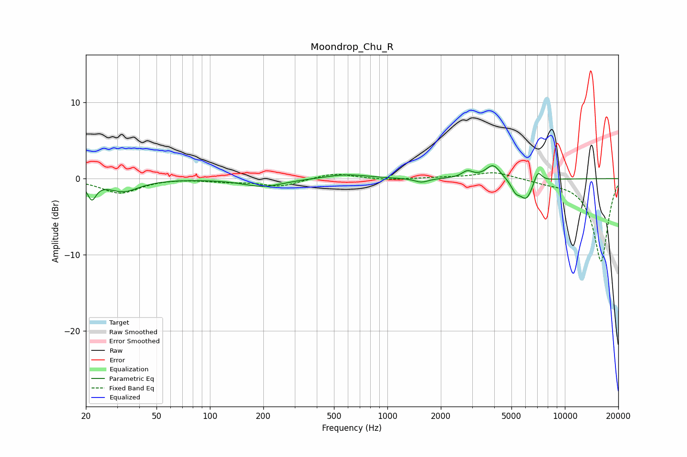

# Moondrop_Chu_R
See [usage instructions](https://github.com/jaakkopasanen/AutoEq#usage) for more options and info.

### Parametric EQs
Apply preamp of -1.8 dB when using parametric equalizer.

|   # | Type    |   Fc (Hz) |    Q |   Gain (dB) |
|-----|---------|-----------|------|-------------|
|   1 | Peaking |        22 | 5.95 |        -2.2 |
|   2 | Peaking |        33 | 1.61 |        -1.6 |
|   3 | Peaking |       200 | 1.24 |        -1   |
|   4 | Peaking |       586 | 1.22 |         0.6 |
|   5 | Peaking |      1556 | 3.62 |        -0.5 |
|   6 | Peaking |      2821 | 4.54 |         0.9 |
|   7 | Peaking |      3942 | 3.48 |         1.9 |
|   8 | Peaking |      5273 | 5.68 |        -1.2 |
|   9 | Peaking |      6064 | 3.64 |        -2.7 |
|  10 | Peaking |      7036 | 6    |         1.7 |

### Fixed Band EQs
When using fixed band (also called graphic) equalizer, apply preamp of **-0.9 dB** (if available) and set gains manually with these parameters.

|   # | Type    |   Fc (Hz) |    Q |   Gain (dB) |
|-----|---------|-----------|------|-------------|
|   1 | Peaking |        31 | 1.41 |        -1.9 |
|   2 | Peaking |        62 | 1.41 |         0.1 |
|   3 | Peaking |       125 | 1.41 |        -0.3 |
|   4 | Peaking |       250 | 1.41 |        -1   |
|   5 | Peaking |       500 | 1.41 |         0.8 |
|   6 | Peaking |      1000 | 1.41 |        -0.2 |
|   7 | Peaking |      2000 | 1.41 |         0.1 |
|   8 | Peaking |      4000 | 1.41 |         0.9 |
|   9 | Peaking |      8000 | 1.41 |        -0.4 |
|  10 | Peaking |     16000 | 1.41 |       -10.9 |

### Graphs

