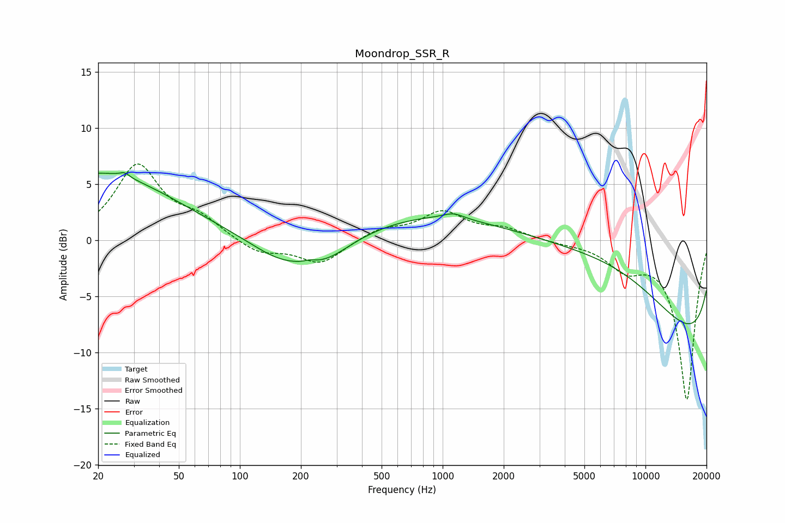

# Moondrop_SSR_R
See [usage instructions](https://github.com/jaakkopasanen/AutoEq#usage) for more options and info.

### Parametric EQs
Apply preamp of -6.1 dB when using parametric equalizer.

|   # | Type    |   Fc (Hz) |    Q |   Gain (dB) |
|-----|---------|-----------|------|-------------|
|   1 | Peaking |        20 | 0.38 |         6   |
|   2 | Peaking |        27 | 5.93 |         0.4 |
|   3 | Peaking |       164 | 0.85 |        -2.3 |
|   4 | Peaking |       187 | 0.47 |         0.3 |
|   5 | Peaking |       221 | 5.62 |         0.2 |
|   6 | Peaking |       269 | 1.13 |        -1.6 |
|   7 | Peaking |      1131 | 2.79 |         0.5 |
|   8 | Peaking |      1638 | 0.3  |         4   |
|   9 | Peaking |      7395 | 0.33 |         9.6 |
|  10 | Peaking |     10000 | 0.18 |       -14.1 |

### Fixed Band EQs
When using fixed band (also called graphic) equalizer, apply preamp of **-6.9 dB** (if available) and set gains manually with these parameters.

|   # | Type    |   Fc (Hz) |    Q |   Gain (dB) |
|-----|---------|-----------|------|-------------|
|   1 | Peaking |        31 | 1.41 |         6.5 |
|   2 | Peaking |        62 | 1.41 |         1.6 |
|   3 | Peaking |       125 | 1.41 |        -1.2 |
|   4 | Peaking |       250 | 1.41 |        -2.1 |
|   5 | Peaking |       500 | 1.41 |         1   |
|   6 | Peaking |      1000 | 1.41 |         2.4 |
|   7 | Peaking |      2000 | 1.41 |         0.9 |
|   8 | Peaking |      4000 | 1.41 |        -0.2 |
|   9 | Peaking |      8000 | 1.41 |        -2.2 |
|  10 | Peaking |     16000 | 1.41 |       -14.2 |

### Graphs

