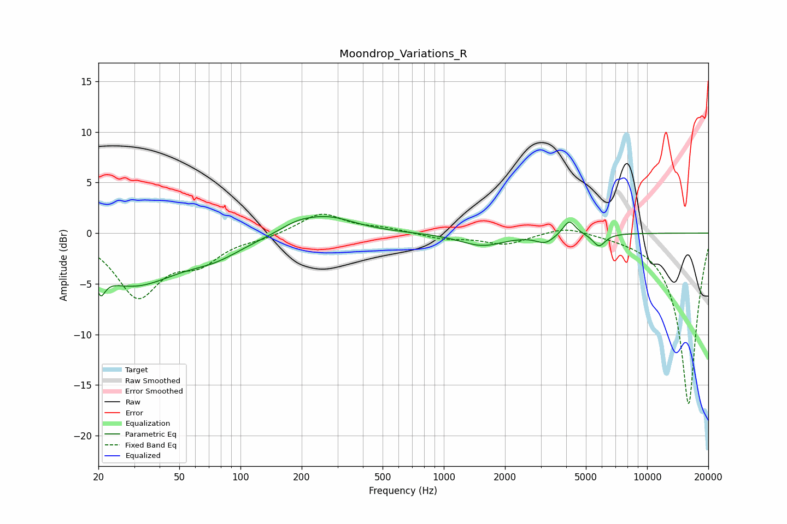

# Moondrop_Variations_R
See [usage instructions](https://github.com/jaakkopasanen/AutoEq#usage) for more options and info.

### Parametric EQs
Apply preamp of -1.7 dB when using parametric equalizer.

|   # | Type    |   Fc (Hz) |    Q |   Gain (dB) |
|-----|---------|-----------|------|-------------|
|   1 | Peaking |        20 | 5.99 |         3.9 |
|   2 | Peaking |        20 | 5.99 |        -5.8 |
|   3 | Peaking |        29 | 0.64 |        -4.9 |
|   4 | Peaking |        76 | 1.02 |        -1.4 |
|   5 | Peaking |       188 | 1.69 |         0.7 |
|   6 | Peaking |       266 | 1.02 |         1.6 |
|   7 | Peaking |      1545 | 1.28 |        -1.2 |
|   8 | Peaking |      3151 | 3.16 |        -0.8 |
|   9 | Peaking |      4143 | 4.6  |         1.5 |
|  10 | Peaking |      5803 | 4.48 |        -1.3 |

### Fixed Band EQs
When using fixed band (also called graphic) equalizer, apply preamp of **-2.0 dB** (if available) and set gains manually with these parameters.

|   # | Type    |   Fc (Hz) |    Q |   Gain (dB) |
|-----|---------|-----------|------|-------------|
|   1 | Peaking |        31 | 1.41 |        -6   |
|   2 | Peaking |        62 | 1.41 |        -2.4 |
|   3 | Peaking |       125 | 1.41 |        -0.4 |
|   4 | Peaking |       250 | 1.41 |         2   |
|   5 | Peaking |       500 | 1.41 |         0.4 |
|   6 | Peaking |      1000 | 1.41 |        -0.5 |
|   7 | Peaking |      2000 | 1.41 |        -1.1 |
|   8 | Peaking |      4000 | 1.41 |         0.8 |
|   9 | Peaking |      8000 | 1.41 |        -0.1 |
|  10 | Peaking |     16000 | 1.41 |       -17   |

### Graphs

