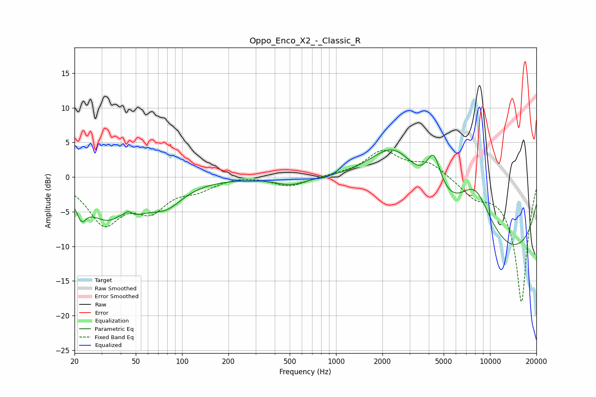

# Oppo_Enco_X2_-_Classic_R
See [usage instructions](https://github.com/jaakkopasanen/AutoEq#usage) for more options and info.

### Parametric EQs
Apply preamp of -4.0 dB when using parametric equalizer.

|   # | Type    |   Fc (Hz) |    Q |   Gain (dB) |
|-----|---------|-----------|------|-------------|
|   1 | Peaking |        22 | 4.84 |        -2.4 |
|   2 | Peaking |        36 | 0.79 |        -6.6 |
|   3 | Peaking |        39 | 2.91 |         1.1 |
|   4 | Peaking |        45 | 5.88 |         0.9 |
|   5 | Peaking |        80 | 1.38 |        -2.4 |
|   6 | Peaking |       507 | 1.49 |        -1.1 |
|   7 | Peaking |      2421 | 0.69 |        11   |
|   8 | Peaking |      4312 | 2.9  |         5.7 |
|   9 | Peaking |      7965 | 1.05 |         9   |
|  10 | Peaking |      8966 | 0.18 |       -13.2 |

### Fixed Band EQs
When using fixed band (also called graphic) equalizer, apply preamp of **-3.9 dB** (if available) and set gains manually with these parameters.

|   # | Type    |   Fc (Hz) |    Q |   Gain (dB) |
|-----|---------|-----------|------|-------------|
|   1 | Peaking |        31 | 1.41 |        -6.4 |
|   2 | Peaking |        62 | 1.41 |        -4.1 |
|   3 | Peaking |       125 | 1.41 |        -1.5 |
|   4 | Peaking |       250 | 1.41 |         0.3 |
|   5 | Peaking |       500 | 1.41 |        -1.4 |
|   6 | Peaking |      1000 | 1.41 |         0.2 |
|   7 | Peaking |      2000 | 1.41 |         3.6 |
|   8 | Peaking |      4000 | 1.41 |         2   |
|   9 | Peaking |      8000 | 1.41 |        -2.2 |
|  10 | Peaking |     16000 | 1.41 |       -18.1 |

### Graphs

