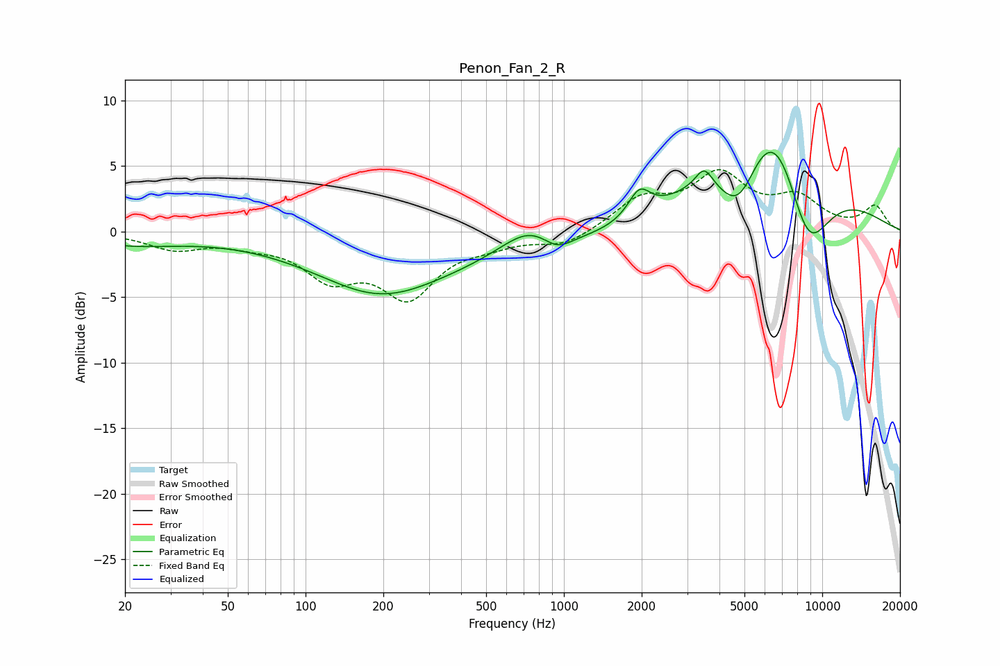

# Penon_Fan_2_R
See [usage instructions](https://github.com/jaakkopasanen/AutoEq#usage) for more options and info.

### Parametric EQs
Apply preamp of -6.1 dB when using parametric equalizer.

|   # | Type    |   Fc (Hz) |    Q |   Gain (dB) |
|-----|---------|-----------|------|-------------|
|   1 | Peaking |        21 | 0.69 |        -0.9 |
|   2 | Peaking |       194 | 0.64 |        -3   |
|   3 | Peaking |       437 | 0.2  |        -2.1 |
|   4 | Peaking |       744 | 1.2  |         2.3 |
|   5 | Peaking |       939 | 2.37 |        -1.2 |
|   6 | Peaking |      1959 | 3.31 |         2.1 |
|   7 | Peaking |      3489 | 4.26 |         1.5 |
|   8 | Peaking |      4766 | 1.64 |        -5.4 |
|   9 | Peaking |      6532 | 0.65 |        13.7 |
|  10 | Peaking |      8719 | 1.21 |        -9.6 |

### Fixed Band EQs
When using fixed band (also called graphic) equalizer, apply preamp of **-4.8 dB** (if available) and set gains manually with these parameters.

|   # | Type    |   Fc (Hz) |    Q |   Gain (dB) |
|-----|---------|-----------|------|-------------|
|   1 | Peaking |        31 | 1.41 |        -1.2 |
|   2 | Peaking |        62 | 1.41 |        -0.7 |
|   3 | Peaking |       125 | 1.41 |        -3.1 |
|   4 | Peaking |       250 | 1.41 |        -4.6 |
|   5 | Peaking |       500 | 1.41 |        -0.7 |
|   6 | Peaking |      1000 | 1.41 |        -1.1 |
|   7 | Peaking |      2000 | 1.41 |         2.3 |
|   8 | Peaking |      4000 | 1.41 |         4   |
|   9 | Peaking |      8000 | 1.41 |         2.3 |
|  10 | Peaking |     16000 | 1.41 |         1.9 |

### Graphs

