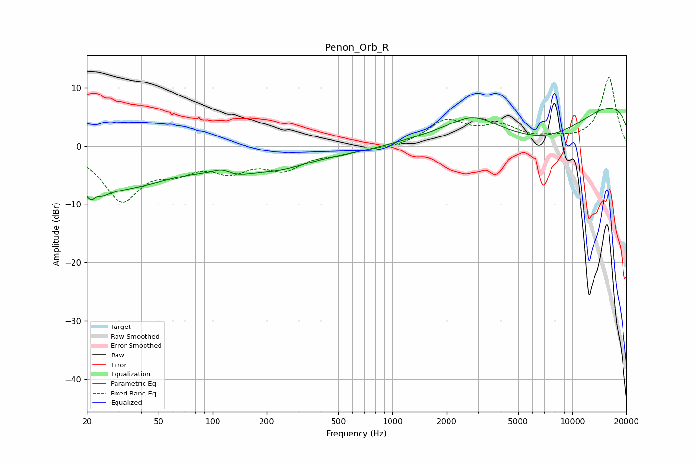

# Penon_Orb_R
See [usage instructions](https://github.com/jaakkopasanen/AutoEq#usage) for more options and info.

### Parametric EQs
Apply preamp of -6.6 dB when using parametric equalizer.

|   # | Type    |   Fc (Hz) |    Q |   Gain (dB) |
|-----|---------|-----------|------|-------------|
|   1 | Peaking |        22 | 3.3  |        -5.8 |
|   2 | Peaking |        22 | 5.26 |         3   |
|   3 | Peaking |        31 | 0.48 |        -6.6 |
|   4 | Peaking |       113 | 2.74 |         1.1 |
|   5 | Peaking |       131 | 1.17 |        -1.9 |
|   6 | Peaking |       241 | 1.09 |        -1.3 |
|   7 | Peaking |       265 | 0.3  |        -1.9 |
|   8 | Peaking |      2792 | 1.16 |         2.6 |
|   9 | Peaking |      7012 | 0.43 |        -8.6 |
|  10 | Peaking |     10000 | 0.18 |        10.6 |

### Fixed Band EQs
When using fixed band (also called graphic) equalizer, apply preamp of **-12.0 dB** (if available) and set gains manually with these parameters.

|   # | Type    |   Fc (Hz) |    Q |   Gain (dB) |
|-----|---------|-----------|------|-------------|
|   1 | Peaking |        31 | 1.41 |        -8.9 |
|   2 | Peaking |        62 | 1.41 |        -3.1 |
|   3 | Peaking |       125 | 1.41 |        -3.5 |
|   4 | Peaking |       250 | 1.41 |        -3.5 |
|   5 | Peaking |       500 | 1.41 |        -1.1 |
|   6 | Peaking |      1000 | 1.41 |        -0.4 |
|   7 | Peaking |      2000 | 1.41 |         4.2 |
|   8 | Peaking |      4000 | 1.41 |         2.9 |
|   9 | Peaking |      8000 | 1.41 |         0.9 |
|  10 | Peaking |     16000 | 1.41 |        11.9 |

### Graphs

