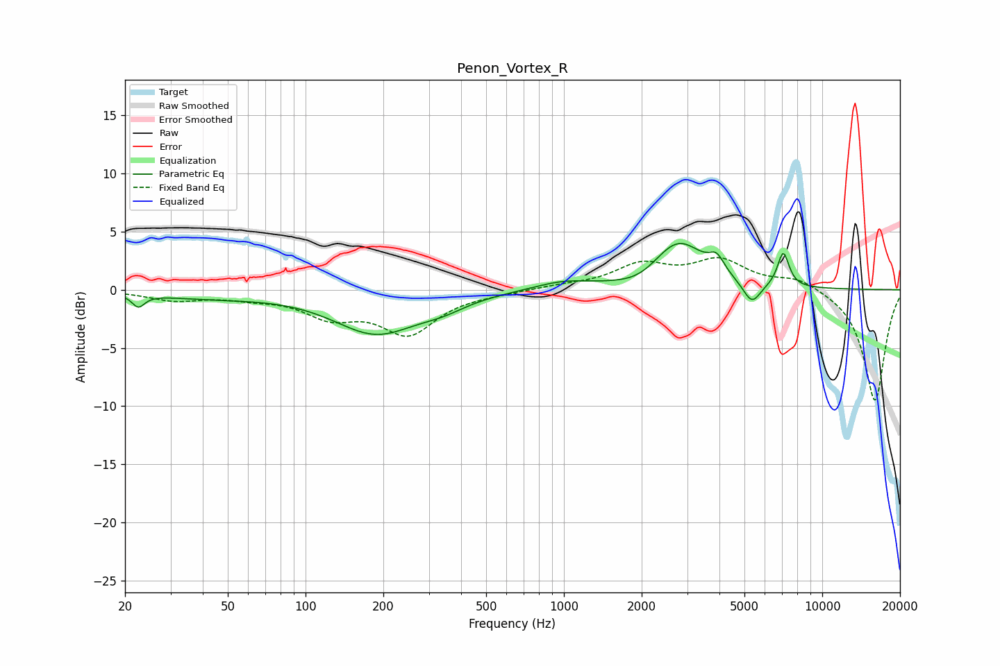

# Penon_Vortex_R
See [usage instructions](https://github.com/jaakkopasanen/AutoEq#usage) for more options and info.

### Parametric EQs
Apply preamp of -4.1 dB when using parametric equalizer.

|   # | Type    |   Fc (Hz) |    Q |   Gain (dB) |
|-----|---------|-----------|------|-------------|
|   1 | Peaking |        23 | 5.98 |        -1.1 |
|   2 | Peaking |        42 | 0.63 |        -0.6 |
|   3 | Peaking |       188 | 0.86 |        -3.6 |
|   4 | Peaking |       341 | 1.53 |        -0.7 |
|   5 | Peaking |       993 | 1.27 |         0.7 |
|   6 | Peaking |      1986 | 1.67 |        -0.8 |
|   7 | Peaking |      2769 | 1.4  |         4.2 |
|   8 | Peaking |      3906 | 4.72 |         1.4 |
|   9 | Peaking |      5341 | 4.03 |        -1.9 |
|  10 | Peaking |      7066 | 6    |         3   |

### Fixed Band EQs
When using fixed band (also called graphic) equalizer, apply preamp of **-2.8 dB** (if available) and set gains manually with these parameters.

|   # | Type    |   Fc (Hz) |    Q |   Gain (dB) |
|-----|---------|-----------|------|-------------|
|   1 | Peaking |        31 | 1.41 |        -0.8 |
|   2 | Peaking |        62 | 1.41 |        -0.5 |
|   3 | Peaking |       125 | 1.41 |        -2   |
|   4 | Peaking |       250 | 1.41 |        -3.6 |
|   5 | Peaking |       500 | 1.41 |        -0.2 |
|   6 | Peaking |      1000 | 1.41 |         0.3 |
|   7 | Peaking |      2000 | 1.41 |         2   |
|   8 | Peaking |      4000 | 1.41 |         2.4 |
|   9 | Peaking |      8000 | 1.41 |         1   |
|  10 | Peaking |     16000 | 1.41 |        -9.6 |

### Graphs

