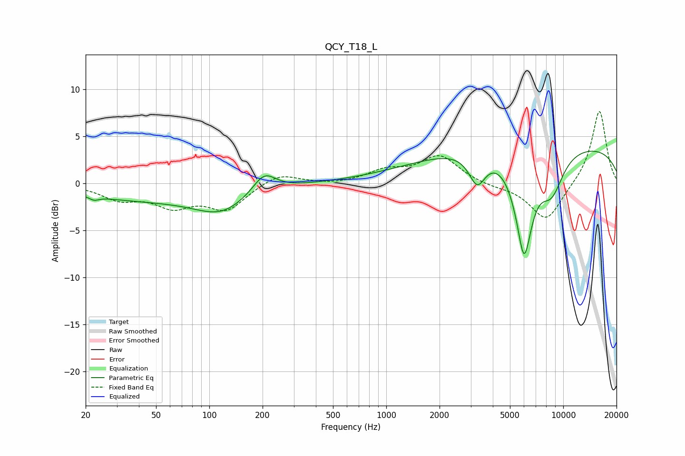

# QCY_T18_L
See [usage instructions](https://github.com/jaakkopasanen/AutoEq#usage) for more options and info.

### Parametric EQs
Apply preamp of -3.5 dB when using parametric equalizer.

|   # | Type    |   Fc (Hz) |    Q |   Gain (dB) |
|-----|---------|-----------|------|-------------|
|   1 | Peaking |        22 | 5.65 |        -0.4 |
|   2 | Peaking |        44 | 0.34 |        -1.7 |
|   3 | Peaking |       117 | 0.97 |        -2.2 |
|   4 | Peaking |       204 | 2.17 |         2.1 |
|   5 | Peaking |      2424 | 0.37 |         1.3 |
|   6 | Peaking |      3265 | 2.95 |        -3.3 |
|   7 | Peaking |      5783 | 4.26 |         1.2 |
|   8 | Peaking |      5975 | 2.8  |       -11.9 |
|   9 | Peaking |      8592 | 1.87 |        -4.2 |
|  10 | Peaking |      9688 | 0.18 |         4.1 |

### Fixed Band EQs
When using fixed band (also called graphic) equalizer, apply preamp of **-7.7 dB** (if available) and set gains manually with these parameters.

|   # | Type    |   Fc (Hz) |    Q |   Gain (dB) |
|-----|---------|-----------|------|-------------|
|   1 | Peaking |        31 | 1.41 |        -1.5 |
|   2 | Peaking |        62 | 1.41 |        -2.1 |
|   3 | Peaking |       125 | 1.41 |        -2.6 |
|   4 | Peaking |       250 | 1.41 |         1.2 |
|   5 | Peaking |       500 | 1.41 |        -0.2 |
|   6 | Peaking |      1000 | 1.41 |         1.2 |
|   7 | Peaking |      2000 | 1.41 |         2.9 |
|   8 | Peaking |      4000 | 1.41 |        -0.3 |
|   9 | Peaking |      8000 | 1.41 |        -4.1 |
|  10 | Peaking |     16000 | 1.41 |         7.9 |

### Graphs

