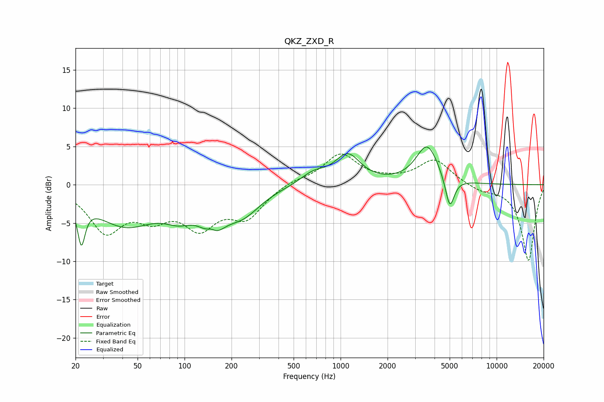

# QKZ_ZXD_R
See [usage instructions](https://github.com/jaakkopasanen/AutoEq#usage) for more options and info.

### Parametric EQs
Apply preamp of -5.0 dB when using parametric equalizer.

|   # | Type    |   Fc (Hz) |    Q |   Gain (dB) |
|-----|---------|-----------|------|-------------|
|   1 | Peaking |        22 | 5.95 |        -5.3 |
|   2 | Peaking |        42 | 0.72 |        -5   |
|   3 | Peaking |        92 | 1.43 |        -2.3 |
|   4 | Peaking |       149 | 3.48 |         3   |
|   5 | Peaking |       150 | 2.28 |        -5.8 |
|   6 | Peaking |       234 | 1.18 |        -3.3 |
|   7 | Peaking |       667 | 1.71 |         1.4 |
|   8 | Peaking |      1110 | 1.74 |         3.7 |
|   9 | Peaking |      3590 | 1.96 |         5.1 |
|  10 | Peaking |      5011 | 4.78 |        -4.3 |

### Fixed Band EQs
When using fixed band (also called graphic) equalizer, apply preamp of **-4.1 dB** (if available) and set gains manually with these parameters.

|   # | Type    |   Fc (Hz) |    Q |   Gain (dB) |
|-----|---------|-----------|------|-------------|
|   1 | Peaking |        31 | 1.41 |        -5.7 |
|   2 | Peaking |        62 | 1.41 |        -3.3 |
|   3 | Peaking |       125 | 1.41 |        -4.9 |
|   4 | Peaking |       250 | 1.41 |        -3.9 |
|   5 | Peaking |       500 | 1.41 |         0.6 |
|   6 | Peaking |      1000 | 1.41 |         3.9 |
|   7 | Peaking |      2000 | 1.41 |         0.3 |
|   8 | Peaking |      4000 | 1.41 |         3.3 |
|   9 | Peaking |      8000 | 1.41 |        -0.8 |
|  10 | Peaking |     16000 | 1.41 |        -9.9 |

### Graphs

