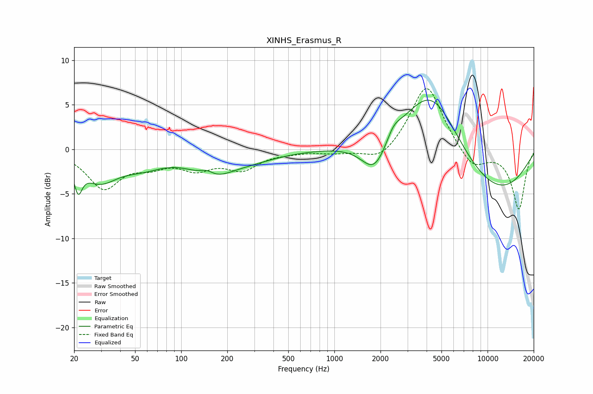

# XINHS_Erasmus_R
See [usage instructions](https://github.com/jaakkopasanen/AutoEq#usage) for more options and info.

### Parametric EQs
Apply preamp of -5.6 dB when using parametric equalizer.

|   # | Type    |   Fc (Hz) |    Q |   Gain (dB) |
|-----|---------|-----------|------|-------------|
|   1 | Peaking |        21 | 5.61 |        -2.8 |
|   2 | Peaking |        29 | 1.2  |        -3.2 |
|   3 | Peaking |        56 | 0.99 |        -1.4 |
|   4 | Peaking |       147 | 2.81 |         0.9 |
|   5 | Peaking |       155 | 1.15 |        -2.4 |
|   6 | Peaking |       268 | 0.7  |        -1.1 |
|   7 | Peaking |      1836 | 1.6  |        -4   |
|   8 | Peaking |      2430 | 3.09 |         1.2 |
|   9 | Peaking |      4343 | 0.7  |         9   |
|  10 | Peaking |      9911 | 0.38 |        -5.8 |

### Fixed Band EQs
When using fixed band (also called graphic) equalizer, apply preamp of **-6.9 dB** (if available) and set gains manually with these parameters.

|   # | Type    |   Fc (Hz) |    Q |   Gain (dB) |
|-----|---------|-----------|------|-------------|
|   1 | Peaking |        31 | 1.41 |        -4.2 |
|   2 | Peaking |        62 | 1.41 |        -1.4 |
|   3 | Peaking |       125 | 1.41 |        -1.9 |
|   4 | Peaking |       250 | 1.41 |        -2   |
|   5 | Peaking |       500 | 1.41 |        -0.2 |
|   6 | Peaking |      1000 | 1.41 |        -0.4 |
|   7 | Peaking |      2000 | 1.41 |        -1.5 |
|   8 | Peaking |      4000 | 1.41 |         7.5 |
|   9 | Peaking |      8000 | 1.41 |        -2.3 |
|  10 | Peaking |     16000 | 1.41 |        -6.7 |

### Graphs

