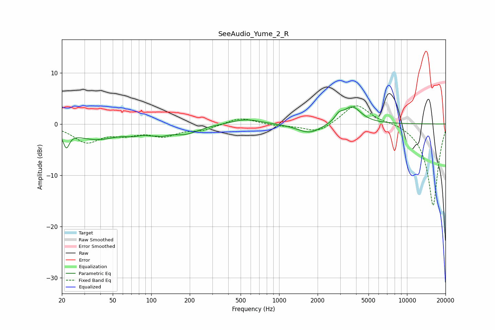

# SeeAudio_Yume_2_R
See [usage instructions](https://github.com/jaakkopasanen/AutoEq#usage) for more options and info.

### Parametric EQs
Apply preamp of -3.4 dB when using parametric equalizer.

|   # | Type    |   Fc (Hz) |    Q |   Gain (dB) |
|-----|---------|-----------|------|-------------|
|   1 | Peaking |        22 | 6    |        -3.1 |
|   2 | Peaking |        37 | 0.8  |        -2.8 |
|   3 | Peaking |        72 | 2.21 |        -0.8 |
|   4 | Peaking |       110 | 3.85 |         1.2 |
|   5 | Peaking |       111 | 2.6  |        -2.3 |
|   6 | Peaking |       183 | 1.29 |        -1.7 |
|   7 | Peaking |       549 | 1.23 |         1   |
|   8 | Peaking |      1733 | 1.47 |        -1.9 |
|   9 | Peaking |      2933 | 4.68 |         1.2 |
|  10 | Peaking |      3721 | 2.01 |         3.4 |

### Fixed Band EQs
When using fixed band (also called graphic) equalizer, apply preamp of **-3.6 dB** (if available) and set gains manually with these parameters.

|   # | Type    |   Fc (Hz) |    Q |   Gain (dB) |
|-----|---------|-----------|------|-------------|
|   1 | Peaking |        31 | 1.41 |        -3.4 |
|   2 | Peaking |        62 | 1.41 |        -1.6 |
|   3 | Peaking |       125 | 1.41 |        -2.1 |
|   4 | Peaking |       250 | 1.41 |        -1.1 |
|   5 | Peaking |       500 | 1.41 |         1.3 |
|   6 | Peaking |      1000 | 1.41 |        -0.3 |
|   7 | Peaking |      2000 | 1.41 |        -1.8 |
|   8 | Peaking |      4000 | 1.41 |         4   |
|   9 | Peaking |      8000 | 1.41 |         0.5 |
|  10 | Peaking |     16000 | 1.41 |       -16.1 |

### Graphs

