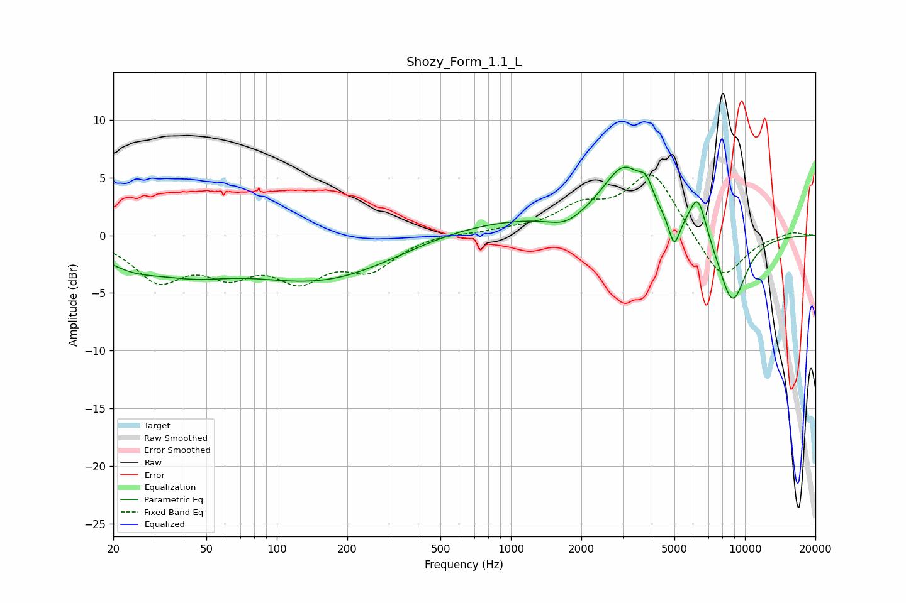

# Shozy_Form_1.1_L
See [usage instructions](https://github.com/jaakkopasanen/AutoEq#usage) for more options and info.

### Parametric EQs
Apply preamp of -6.0 dB when using parametric equalizer.

|   # | Type    |   Fc (Hz) |    Q |   Gain (dB) |
|-----|---------|-----------|------|-------------|
|   1 | Peaking |        24 | 1.02 |        -1.9 |
|   2 | Peaking |        44 | 0.86 |        -1.7 |
|   3 | Peaking |       167 | 0.4  |        -4.3 |
|   4 | Peaking |       697 | 0.32 |         1.8 |
|   5 | Peaking |      1710 | 1.89 |        -1   |
|   6 | Peaking |      3056 | 1.48 |         5.4 |
|   7 | Peaking |      3785 | 5.23 |         1.5 |
|   8 | Peaking |      4984 | 5.93 |        -2.6 |
|   9 | Peaking |      6293 | 3.68 |         3.7 |
|  10 | Peaking |      8829 | 2.09 |        -6.1 |

### Fixed Band EQs
When using fixed band (also called graphic) equalizer, apply preamp of **-5.3 dB** (if available) and set gains manually with these parameters.

|   # | Type    |   Fc (Hz) |    Q |   Gain (dB) |
|-----|---------|-----------|------|-------------|
|   1 | Peaking |        31 | 1.41 |        -3.6 |
|   2 | Peaking |        62 | 1.41 |        -2.7 |
|   3 | Peaking |       125 | 1.41 |        -3.3 |
|   4 | Peaking |       250 | 1.41 |        -2.7 |
|   5 | Peaking |       500 | 1.41 |         0.2 |
|   6 | Peaking |      1000 | 1.41 |         0.4 |
|   7 | Peaking |      2000 | 1.41 |         2.1 |
|   8 | Peaking |      4000 | 1.41 |         5.4 |
|   9 | Peaking |      8000 | 1.41 |        -4.1 |
|  10 | Peaking |     16000 | 1.41 |         0.4 |

### Graphs

