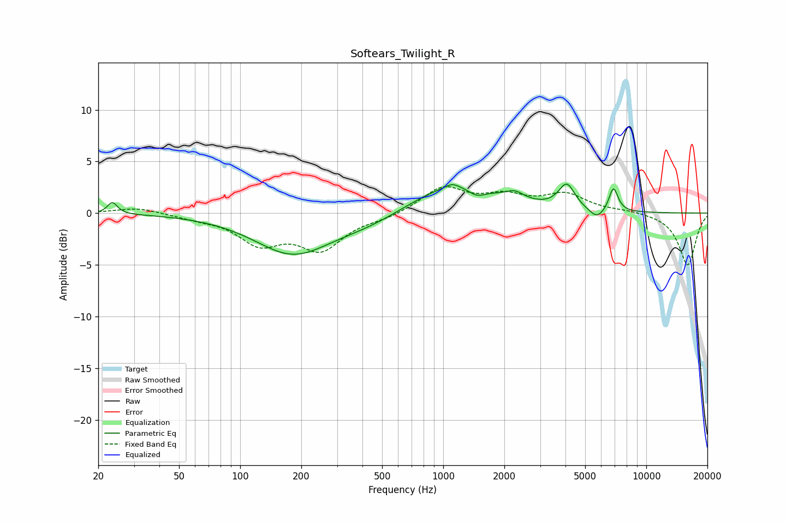

# Softears_Twilight_R
See [usage instructions](https://github.com/jaakkopasanen/AutoEq#usage) for more options and info.

### Parametric EQs
Apply preamp of -2.9 dB when using parametric equalizer.

|   # | Type    |   Fc (Hz) |    Q |   Gain (dB) |
|-----|---------|-----------|------|-------------|
|   1 | Peaking |        23 | 5.97 |         1.1 |
|   2 | Peaking |       182 | 0.75 |        -3.9 |
|   3 | Peaking |       436 | 0.78 |        -1   |
|   4 | Peaking |      1110 | 4.62 |         0.4 |
|   5 | Peaking |      1128 | 0.66 |         2.9 |
|   6 | Peaking |      1463 | 3.24 |        -0.8 |
|   7 | Peaking |      2251 | 3.16 |         0.8 |
|   8 | Peaking |      4058 | 3.55 |         2.4 |
|   9 | Peaking |      5717 | 3.64 |        -1   |
|  10 | Peaking |      6893 | 6    |         2.4 |

### Fixed Band EQs
When using fixed band (also called graphic) equalizer, apply preamp of **-2.7 dB** (if available) and set gains manually with these parameters.

|   # | Type    |   Fc (Hz) |    Q |   Gain (dB) |
|-----|---------|-----------|------|-------------|
|   1 | Peaking |        31 | 1.41 |         0.6 |
|   2 | Peaking |        62 | 1.41 |        -0.4 |
|   3 | Peaking |       125 | 1.41 |        -2.7 |
|   4 | Peaking |       250 | 1.41 |        -3.3 |
|   5 | Peaking |       500 | 1.41 |        -0.4 |
|   6 | Peaking |      1000 | 1.41 |         2.4 |
|   7 | Peaking |      2000 | 1.41 |         1.4 |
|   8 | Peaking |      4000 | 1.41 |         1.7 |
|   9 | Peaking |      8000 | 1.41 |         0.2 |
|  10 | Peaking |     16000 | 1.41 |        -5   |

### Graphs

