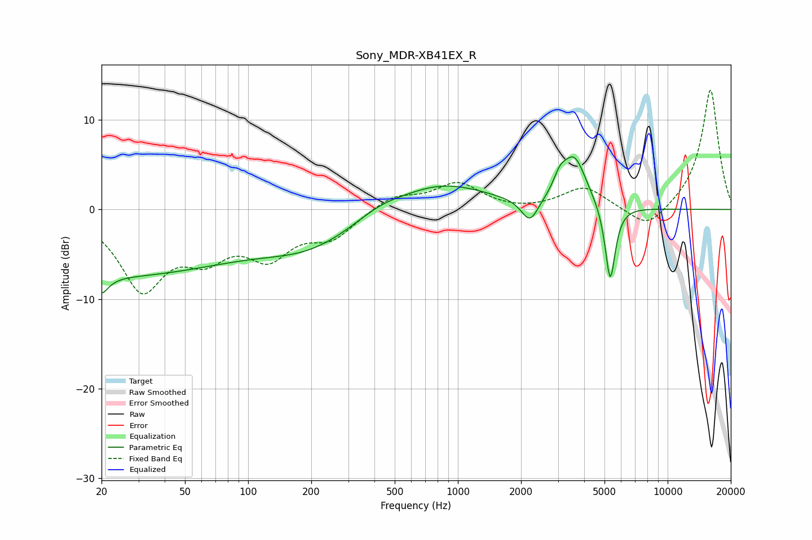

# Sony_MDR-XB41EX_R
See [usage instructions](https://github.com/jaakkopasanen/AutoEq#usage) for more options and info.

### Parametric EQs
Apply preamp of -6.0 dB when using parametric equalizer.

|   # | Type    |   Fc (Hz) |    Q |   Gain (dB) |
|-----|---------|-----------|------|-------------|
|   1 | Peaking |        20 | 5.56 |        -8.3 |
|   2 | Peaking |        20 | 5.99 |         6.3 |
|   3 | Peaking |        20 | 0.19 |        -7.3 |
|   4 | Peaking |       201 | 0.61 |        -3.3 |
|   5 | Peaking |       421 | 1.29 |         0.9 |
|   6 | Peaking |       831 | 0.64 |         3   |
|   7 | Peaking |      2205 | 3.49 |        -2.7 |
|   8 | Peaking |      3062 | 4.76 |         1.6 |
|   9 | Peaking |      3584 | 2.4  |         5.6 |
|  10 | Peaking |      5323 | 5.72 |        -8.8 |

### Fixed Band EQs
When using fixed band (also called graphic) equalizer, apply preamp of **-13.4 dB** (if available) and set gains manually with these parameters.

|   # | Type    |   Fc (Hz) |    Q |   Gain (dB) |
|-----|---------|-----------|------|-------------|
|   1 | Peaking |        31 | 1.41 |        -8.5 |
|   2 | Peaking |        62 | 1.41 |        -4.1 |
|   3 | Peaking |       125 | 1.41 |        -4.6 |
|   4 | Peaking |       250 | 1.41 |        -2.8 |
|   5 | Peaking |       500 | 1.41 |         1.6 |
|   6 | Peaking |      1000 | 1.41 |         2.8 |
|   7 | Peaking |      2000 | 1.41 |        -0.2 |
|   8 | Peaking |      4000 | 1.41 |         2.5 |
|   9 | Peaking |      8000 | 1.41 |        -2.5 |
|  10 | Peaking |     16000 | 1.41 |        13.5 |

### Graphs

