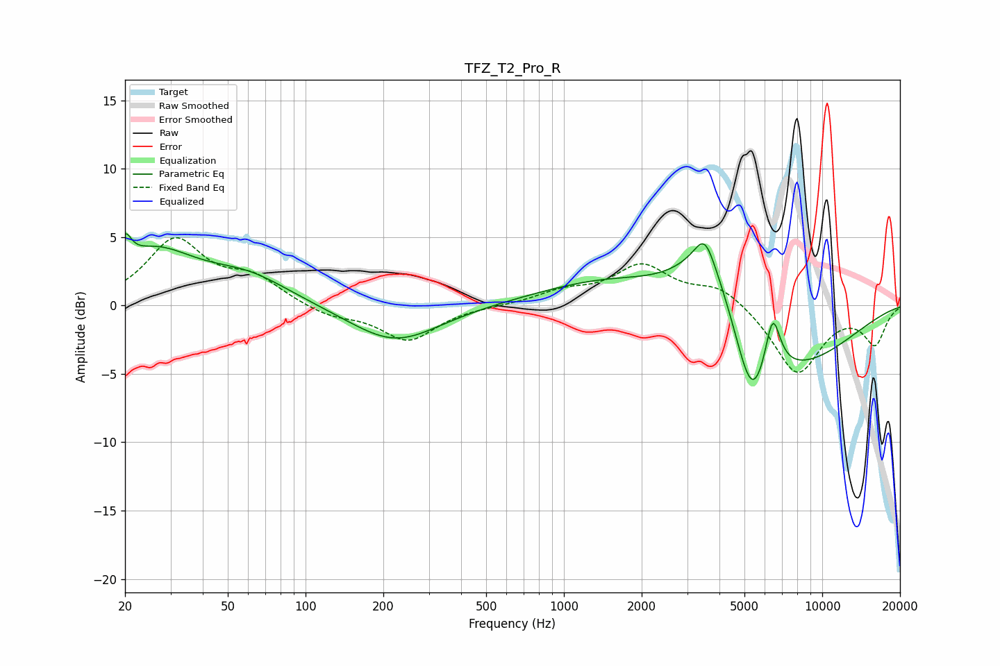

# TFZ_T2_Pro_R
See [usage instructions](https://github.com/jaakkopasanen/AutoEq#usage) for more options and info.

### Parametric EQs
Apply preamp of -5.3 dB when using parametric equalizer.

|   # | Type    |   Fc (Hz) |    Q |   Gain (dB) |
|-----|---------|-----------|------|-------------|
|   1 | Peaking |        20 | 5.99 |         1.9 |
|   2 | Peaking |        26 | 0.9  |         3.7 |
|   3 | Peaking |        60 | 0.84 |         1.9 |
|   4 | Peaking |       222 | 0.82 |        -2.8 |
|   5 | Peaking |      1524 | 0.52 |         1.9 |
|   6 | Peaking |      3507 | 3.74 |         1.9 |
|   7 | Peaking |      3649 | 1.17 |         5.1 |
|   8 | Peaking |      5329 | 2.23 |        -5.4 |
|   9 | Peaking |      6426 | 4.58 |         4.2 |
|  10 | Peaking |      7299 | 0.52 |        -4.7 |

### Fixed Band EQs
When using fixed band (also called graphic) equalizer, apply preamp of **-5.1 dB** (if available) and set gains manually with these parameters.

|   # | Type    |   Fc (Hz) |    Q |   Gain (dB) |
|-----|---------|-----------|------|-------------|
|   1 | Peaking |        31 | 1.41 |         4.7 |
|   2 | Peaking |        62 | 1.41 |         1.8 |
|   3 | Peaking |       125 | 1.41 |        -0.8 |
|   4 | Peaking |       250 | 1.41 |        -2.5 |
|   5 | Peaking |       500 | 1.41 |        -0   |
|   6 | Peaking |      1000 | 1.41 |         0.9 |
|   7 | Peaking |      2000 | 1.41 |         2.8 |
|   8 | Peaking |      4000 | 1.41 |         1.4 |
|   9 | Peaking |      8000 | 1.41 |        -5   |
|  10 | Peaking |     16000 | 1.41 |        -2.7 |

### Graphs

