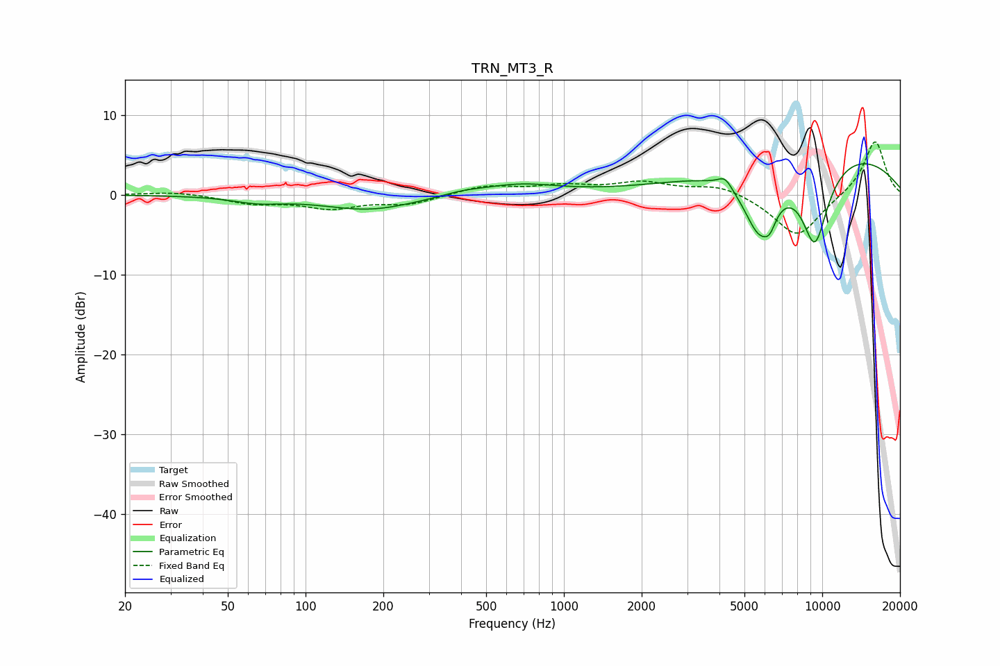

# TRN_MT3_R
See [usage instructions](https://github.com/jaakkopasanen/AutoEq#usage) for more options and info.

### Parametric EQs
Apply preamp of -4.0 dB when using parametric equalizer.

|   # | Type    |   Fc (Hz) |    Q |   Gain (dB) |
|-----|---------|-----------|------|-------------|
|   1 | Peaking |        65 | 1.48 |        -0.7 |
|   2 | Peaking |       177 | 0.79 |        -1.9 |
|   3 | Peaking |       403 | 1.82 |         0.4 |
|   4 | Peaking |       669 | 0.95 |         1.3 |
|   5 | Peaking |      4204 | 5.15 |         1.3 |
|   6 | Peaking |      5215 | 2.15 |        -0.1 |
|   7 | Peaking |      5712 | 2.12 |        -7.9 |
|   8 | Peaking |      6267 | 5.8  |        -1.7 |
|   9 | Peaking |      9360 | 2.23 |       -10.7 |
|  10 | Peaking |     10000 | 0.3  |         5.8 |

### Fixed Band EQs
When using fixed band (also called graphic) equalizer, apply preamp of **-6.7 dB** (if available) and set gains manually with these parameters.

|   # | Type    |   Fc (Hz) |    Q |   Gain (dB) |
|-----|---------|-----------|------|-------------|
|   1 | Peaking |        31 | 1.41 |         0.4 |
|   2 | Peaking |        62 | 1.41 |        -1   |
|   3 | Peaking |       125 | 1.41 |        -1.5 |
|   4 | Peaking |       250 | 1.41 |        -1.1 |
|   5 | Peaking |       500 | 1.41 |         1.1 |
|   6 | Peaking |      1000 | 1.41 |         1   |
|   7 | Peaking |      2000 | 1.41 |         1.4 |
|   8 | Peaking |      4000 | 1.41 |         1.3 |
|   9 | Peaking |      8000 | 1.41 |        -5.4 |
|  10 | Peaking |     16000 | 1.41 |         6.9 |

### Graphs

