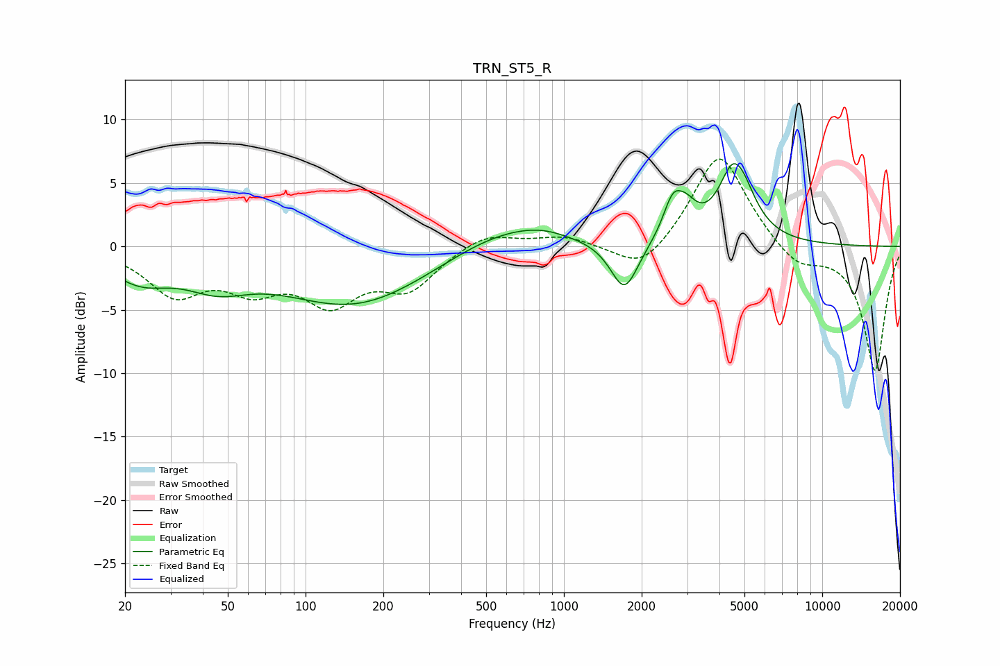

# TRN_ST5_R
See [usage instructions](https://github.com/jaakkopasanen/AutoEq#usage) for more options and info.

### Parametric EQs
Apply preamp of -6.6 dB when using parametric equalizer.

|   # | Type    |   Fc (Hz) |    Q |   Gain (dB) |
|-----|---------|-----------|------|-------------|
|   1 | Peaking |        23 | 1.19 |        -2.2 |
|   2 | Peaking |        45 | 1.12 |        -2   |
|   3 | Peaking |       156 | 0.49 |        -4.6 |
|   4 | Peaking |       596 | 0.65 |         2   |
|   5 | Peaking |       821 | 1.52 |         0.4 |
|   6 | Peaking |      1716 | 2.64 |        -4   |
|   7 | Peaking |      2635 | 3.76 |         2.7 |
|   8 | Peaking |      2974 | 3.19 |         1.8 |
|   9 | Peaking |      4639 | 2.42 |         7.3 |
|  10 | Peaking |      4698 | 4.69 |        -1.1 |

### Fixed Band EQs
When using fixed band (also called graphic) equalizer, apply preamp of **-7.0 dB** (if available) and set gains manually with these parameters.

|   # | Type    |   Fc (Hz) |    Q |   Gain (dB) |
|-----|---------|-----------|------|-------------|
|   1 | Peaking |        31 | 1.41 |        -3.5 |
|   2 | Peaking |        62 | 1.41 |        -2.7 |
|   3 | Peaking |       125 | 1.41 |        -3.9 |
|   4 | Peaking |       250 | 1.41 |        -3.1 |
|   5 | Peaking |       500 | 1.41 |         1.2 |
|   6 | Peaking |      1000 | 1.41 |         0.8 |
|   7 | Peaking |      2000 | 1.41 |        -2.3 |
|   8 | Peaking |      4000 | 1.41 |         7.6 |
|   9 | Peaking |      8000 | 1.41 |        -1.7 |
|  10 | Peaking |     16000 | 1.41 |        -9.8 |

### Graphs

