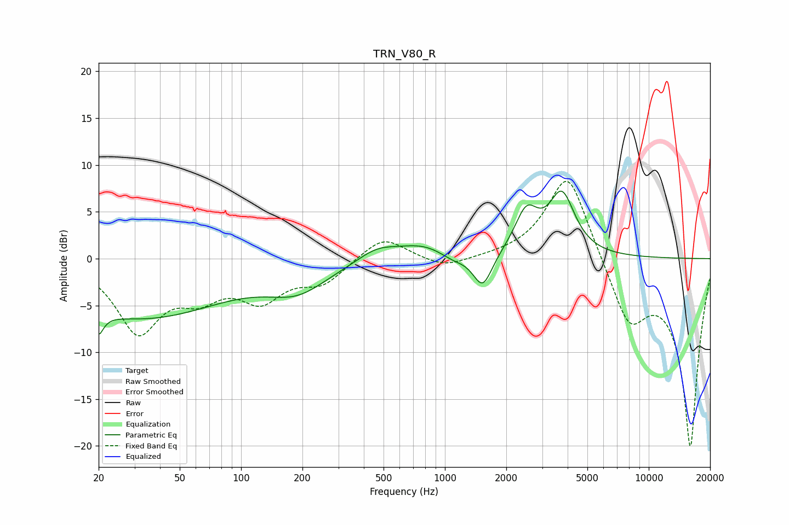

# TRN_V80_R
See [usage instructions](https://github.com/jaakkopasanen/AutoEq#usage) for more options and info.

### Parametric EQs
Apply preamp of -7.3 dB when using parametric equalizer.

|   # | Type    |   Fc (Hz) |    Q |   Gain (dB) |
|-----|---------|-----------|------|-------------|
|   1 | Peaking |        20 | 5.89 |        -7   |
|   2 | Peaking |        20 | 6    |         4.6 |
|   3 | Peaking |        32 | 0.34 |        -6.3 |
|   4 | Peaking |       190 | 0.94 |        -2.7 |
|   5 | Peaking |       464 | 1.47 |         1.3 |
|   6 | Peaking |       776 | 1.1  |         1.5 |
|   7 | Peaking |      1095 | 2.13 |        -0.7 |
|   8 | Peaking |      1532 | 3.03 |        -3.7 |
|   9 | Peaking |      2511 | 2.44 |         4.4 |
|  10 | Peaking |      3748 | 2.22 |         6.4 |

### Fixed Band EQs
When using fixed band (also called graphic) equalizer, apply preamp of **-8.3 dB** (if available) and set gains manually with these parameters.

|   # | Type    |   Fc (Hz) |    Q |   Gain (dB) |
|-----|---------|-----------|------|-------------|
|   1 | Peaking |        31 | 1.41 |        -7.5 |
|   2 | Peaking |        62 | 1.41 |        -3.1 |
|   3 | Peaking |       125 | 1.41 |        -3.9 |
|   4 | Peaking |       250 | 1.41 |        -2.4 |
|   5 | Peaking |       500 | 1.41 |         2.5 |
|   6 | Peaking |      1000 | 1.41 |        -1.1 |
|   7 | Peaking |      2000 | 1.41 |         0.1 |
|   8 | Peaking |      4000 | 1.41 |         9.6 |
|   9 | Peaking |      8000 | 1.41 |        -6.5 |
|  10 | Peaking |     16000 | 1.41 |       -20   |

### Graphs

