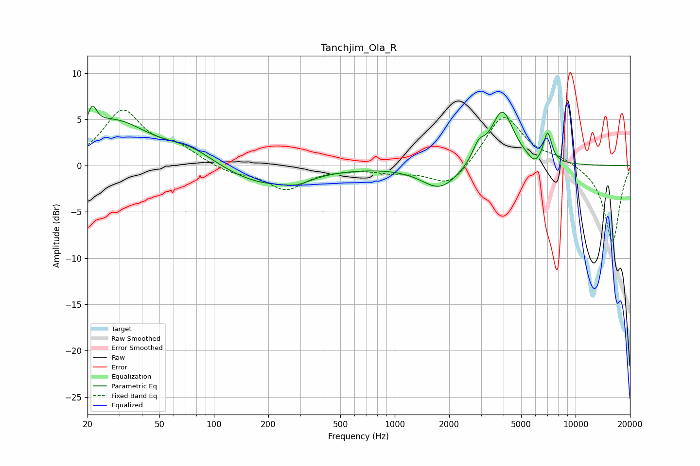

# Tanchjim_Ola_R
See [usage instructions](https://github.com/jaakkopasanen/AutoEq#usage) for more options and info.

### Parametric EQs
Apply preamp of -6.5 dB when using parametric equalizer.

|   # | Type    |   Fc (Hz) |    Q |   Gain (dB) |
|-----|---------|-----------|------|-------------|
|   1 | Peaking |        21 | 5.93 |         2.3 |
|   2 | Peaking |        28 | 0.72 |         4.7 |
|   3 | Peaking |        75 | 1.07 |         1.5 |
|   4 | Peaking |       188 | 0.64 |        -2.1 |
|   5 | Peaking |       288 | 1.91 |        -0.6 |
|   6 | Peaking |      1783 | 1.39 |        -2.6 |
|   7 | Peaking |      2906 | 4.27 |         1.7 |
|   8 | Peaking |      3935 | 2.23 |         6   |
|   9 | Peaking |      5939 | 4.29 |        -0.9 |
|  10 | Peaking |      7006 | 6    |         3.2 |

### Fixed Band EQs
When using fixed band (also called graphic) equalizer, apply preamp of **-6.1 dB** (if available) and set gains manually with these parameters.

|   # | Type    |   Fc (Hz) |    Q |   Gain (dB) |
|-----|---------|-----------|------|-------------|
|   1 | Peaking |        31 | 1.41 |         5.8 |
|   2 | Peaking |        62 | 1.41 |         1.7 |
|   3 | Peaking |       125 | 1.41 |        -0.8 |
|   4 | Peaking |       250 | 1.41 |        -2.5 |
|   5 | Peaking |       500 | 1.41 |        -0.2 |
|   6 | Peaking |      1000 | 1.41 |        -0.6 |
|   7 | Peaking |      2000 | 1.41 |        -2.4 |
|   8 | Peaking |      4000 | 1.41 |         5.6 |
|   9 | Peaking |      8000 | 1.41 |         0.8 |
|  10 | Peaking |     16000 | 1.41 |        -8.3 |

### Graphs

