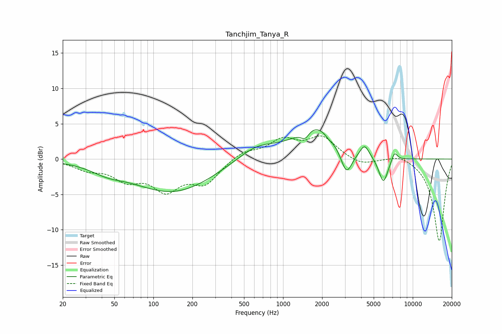

# Tanchjim_Tanya_R
See [usage instructions](https://github.com/jaakkopasanen/AutoEq#usage) for more options and info.

### Parametric EQs
Apply preamp of -4.2 dB when using parametric equalizer.

|   # | Type    |   Fc (Hz) |    Q |   Gain (dB) |
|-----|---------|-----------|------|-------------|
|   1 | Peaking |        44 | 1.15 |        -1   |
|   2 | Peaking |       142 | 0.45 |        -4.7 |
|   3 | Peaking |       627 | 0.88 |         2.1 |
|   4 | Peaking |      1478 | 4.4  |        -1.2 |
|   5 | Peaking |      1794 | 0.94 |         4.6 |
|   6 | Peaking |      2258 | 4.69 |        -0.4 |
|   7 | Peaking |      3079 | 3.22 |        -3.7 |
|   8 | Peaking |      4256 | 4.04 |         1.7 |
|   9 | Peaking |      5935 | 3.82 |        -3.7 |
|  10 | Peaking |      7231 | 6    |         1.3 |

### Fixed Band EQs
When using fixed band (also called graphic) equalizer, apply preamp of **-3.4 dB** (if available) and set gains manually with these parameters.

|   # | Type    |   Fc (Hz) |    Q |   Gain (dB) |
|-----|---------|-----------|------|-------------|
|   1 | Peaking |        31 | 1.41 |        -1.3 |
|   2 | Peaking |        62 | 1.41 |        -2.5 |
|   3 | Peaking |       125 | 1.41 |        -3.9 |
|   4 | Peaking |       250 | 1.41 |        -3.2 |
|   5 | Peaking |       500 | 1.41 |         1.1 |
|   6 | Peaking |      1000 | 1.41 |         2.5 |
|   7 | Peaking |      2000 | 1.41 |         3   |
|   8 | Peaking |      4000 | 1.41 |        -0.9 |
|   9 | Peaking |      8000 | 1.41 |         0.8 |
|  10 | Peaking |     16000 | 1.41 |       -11.7 |

### Graphs

