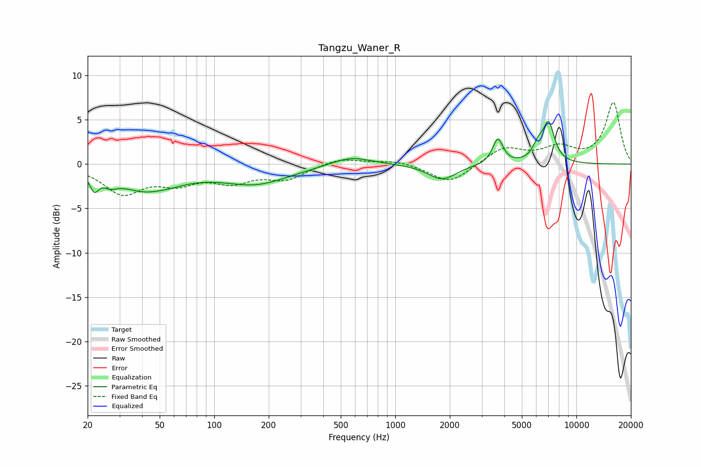

# Tangzu_Waner_R
See [usage instructions](https://github.com/jaakkopasanen/AutoEq#usage) for more options and info.

### Parametric EQs
Apply preamp of -4.9 dB when using parametric equalizer.

|   # | Type    |   Fc (Hz) |    Q |   Gain (dB) |
|-----|---------|-----------|------|-------------|
|   1 | Peaking |        22 | 5.98 |        -1.8 |
|   2 | Peaking |        27 | 3.48 |        -0.9 |
|   3 | Peaking |        44 | 0.9  |        -3.1 |
|   4 | Peaking |        48 | 1.91 |         0.3 |
|   5 | Peaking |       169 | 0.74 |        -2.1 |
|   6 | Peaking |       567 | 1.25 |         1   |
|   7 | Peaking |      1815 | 1.82 |        -1.8 |
|   8 | Peaking |      3682 | 4.98 |         2.9 |
|   9 | Peaking |      6156 | 4.48 |         1.6 |
|  10 | Peaking |      7035 | 4.25 |         4.3 |

### Fixed Band EQs
When using fixed band (also called graphic) equalizer, apply preamp of **-7.1 dB** (if available) and set gains manually with these parameters.

|   # | Type    |   Fc (Hz) |    Q |   Gain (dB) |
|-----|---------|-----------|------|-------------|
|   1 | Peaking |        31 | 1.41 |        -3.1 |
|   2 | Peaking |        62 | 1.41 |        -1.8 |
|   3 | Peaking |       125 | 1.41 |        -1.7 |
|   4 | Peaking |       250 | 1.41 |        -1.6 |
|   5 | Peaking |       500 | 1.41 |         0.8 |
|   6 | Peaking |      1000 | 1.41 |         0.5 |
|   7 | Peaking |      2000 | 1.41 |        -2.2 |
|   8 | Peaking |      4000 | 1.41 |         1.9 |
|   9 | Peaking |      8000 | 1.41 |         1.7 |
|  10 | Peaking |     16000 | 1.41 |         6.9 |

### Graphs

