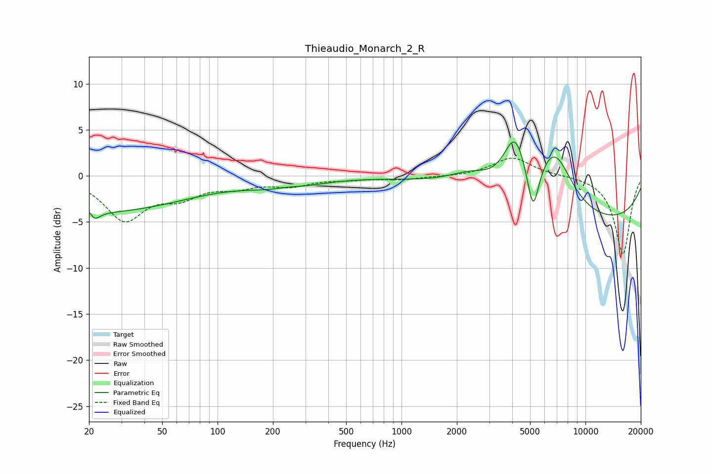

# Thieaudio_Monarch_2_R
See [usage instructions](https://github.com/jaakkopasanen/AutoEq#usage) for more options and info.

### Parametric EQs
Apply preamp of -3.8 dB when using parametric equalizer.

|   # | Type    |   Fc (Hz) |    Q |   Gain (dB) |
|-----|---------|-----------|------|-------------|
|   1 | Peaking |        20 | 5.86 |         3.3 |
|   2 | Peaking |        21 | 5.11 |        -3.7 |
|   3 | Peaking |        23 | 0.3  |        -3.8 |
|   4 | Peaking |       230 | 0.86 |        -1.4 |
|   5 | Peaking |       237 | 1.63 |         0.5 |
|   6 | Peaking |      2416 | 1.08 |         2   |
|   7 | Peaking |      4132 | 2.26 |         5.8 |
|   8 | Peaking |      5197 | 4.44 |        -5.2 |
|   9 | Peaking |      6754 | 1.33 |         6.7 |
|  10 | Peaking |      9834 | 0.22 |        -5.2 |

### Fixed Band EQs
When using fixed band (also called graphic) equalizer, apply preamp of **-2.0 dB** (if available) and set gains manually with these parameters.

|   # | Type    |   Fc (Hz) |    Q |   Gain (dB) |
|-----|---------|-----------|------|-------------|
|   1 | Peaking |        31 | 1.41 |        -4.6 |
|   2 | Peaking |        62 | 1.41 |        -1.9 |
|   3 | Peaking |       125 | 1.41 |        -1   |
|   4 | Peaking |       250 | 1.41 |        -0.9 |
|   5 | Peaking |       500 | 1.41 |        -0.3 |
|   6 | Peaking |      1000 | 1.41 |        -0.4 |
|   7 | Peaking |      2000 | 1.41 |        -0.1 |
|   8 | Peaking |      4000 | 1.41 |         2   |
|   9 | Peaking |      8000 | 1.41 |         0.1 |
|  10 | Peaking |     16000 | 1.41 |        -8.5 |

### Graphs

