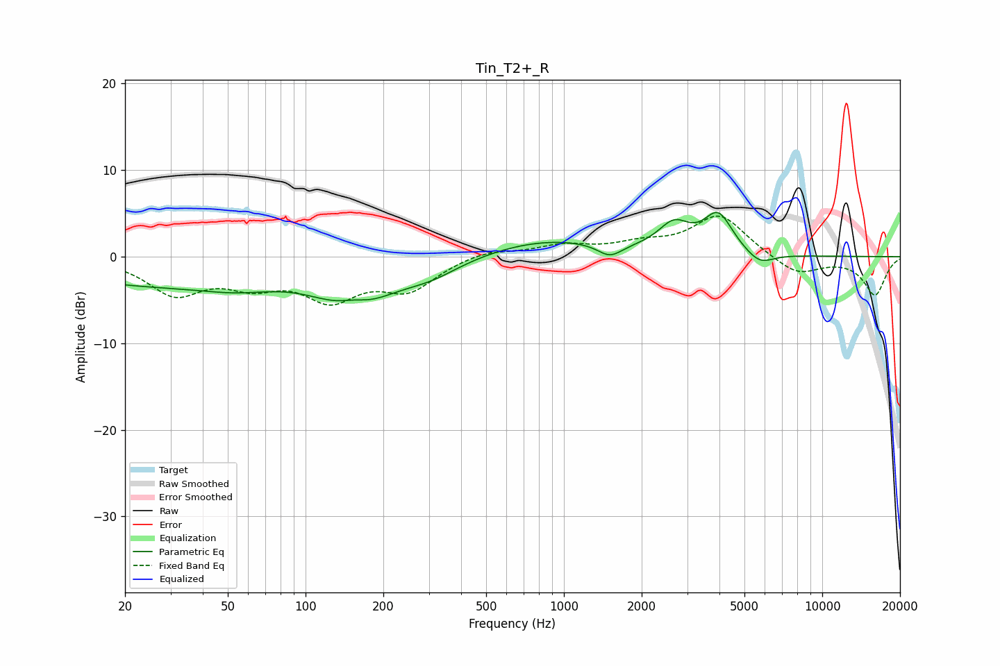

# Tin_T2+_R
See [usage instructions](https://github.com/jaakkopasanen/AutoEq#usage) for more options and info.

### Parametric EQs
Apply preamp of -5.2 dB when using parametric equalizer.

|   # | Type    |   Fc (Hz) |    Q |   Gain (dB) |
|-----|---------|-----------|------|-------------|
|   1 | Peaking |        23 | 0.38 |        -3   |
|   2 | Peaking |        55 | 0.93 |        -1.4 |
|   3 | Peaking |       153 | 2.37 |         1   |
|   4 | Peaking |       154 | 0.91 |        -5.2 |
|   5 | Peaking |       308 | 1.22 |        -1.5 |
|   6 | Peaking |       862 | 0.58 |         2   |
|   7 | Peaking |      1508 | 2.99 |        -1.5 |
|   8 | Peaking |      2669 | 2.29 |         3.1 |
|   9 | Peaking |      3957 | 2.52 |         4.5 |
|  10 | Peaking |      5716 | 2.57 |        -1.5 |

### Fixed Band EQs
When using fixed band (also called graphic) equalizer, apply preamp of **-4.8 dB** (if available) and set gains manually with these parameters.

|   # | Type    |   Fc (Hz) |    Q |   Gain (dB) |
|-----|---------|-----------|------|-------------|
|   1 | Peaking |        31 | 1.41 |        -4   |
|   2 | Peaking |        62 | 1.41 |        -2.6 |
|   3 | Peaking |       125 | 1.41 |        -4.4 |
|   4 | Peaking |       250 | 1.41 |        -3.5 |
|   5 | Peaking |       500 | 1.41 |         0.8 |
|   6 | Peaking |      1000 | 1.41 |         1.2 |
|   7 | Peaking |      2000 | 1.41 |         1.2 |
|   8 | Peaking |      4000 | 1.41 |         4.8 |
|   9 | Peaking |      8000 | 1.41 |        -2.2 |
|  10 | Peaking |     16000 | 1.41 |        -4.4 |

### Graphs

