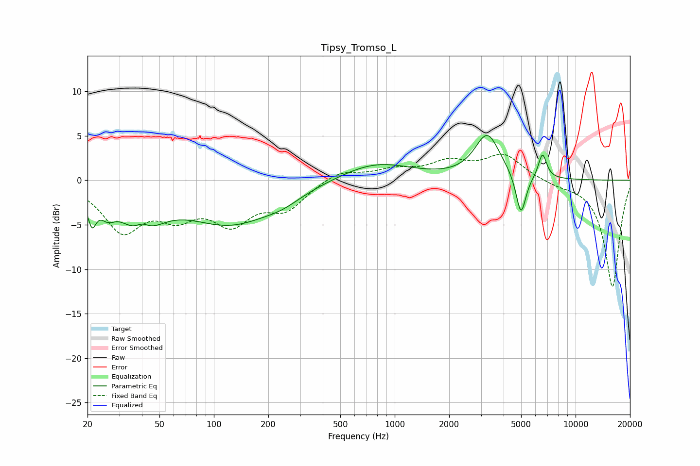

# Tipsy_Tromso_L
See [usage instructions](https://github.com/jaakkopasanen/AutoEq#usage) for more options and info.

### Parametric EQs
Apply preamp of -5.1 dB when using parametric equalizer.

|   # | Type    |   Fc (Hz) |    Q |   Gain (dB) |
|-----|---------|-----------|------|-------------|
|   1 | Peaking |        21 | 5.98 |        -3.2 |
|   2 | Peaking |        26 | 3.35 |        -1.7 |
|   3 | Peaking |        39 | 1.34 |        -4.8 |
|   4 | Peaking |        40 | 3.38 |         1.5 |
|   5 | Peaking |       123 | 0.57 |        -4.7 |
|   6 | Peaking |       240 | 1.37 |        -0.8 |
|   7 | Peaking |       786 | 0.71 |         2.1 |
|   8 | Peaking |      3253 | 2.03 |         5   |
|   9 | Peaking |      4989 | 5.07 |        -4.8 |
|  10 | Peaking |      6561 | 6    |         2.8 |

### Fixed Band EQs
When using fixed band (also called graphic) equalizer, apply preamp of **-3.0 dB** (if available) and set gains manually with these parameters.

|   # | Type    |   Fc (Hz) |    Q |   Gain (dB) |
|-----|---------|-----------|------|-------------|
|   1 | Peaking |        31 | 1.41 |        -5.3 |
|   2 | Peaking |        62 | 1.41 |        -3.2 |
|   3 | Peaking |       125 | 1.41 |        -4.2 |
|   4 | Peaking |       250 | 1.41 |        -2.9 |
|   5 | Peaking |       500 | 1.41 |         1.2 |
|   6 | Peaking |      1000 | 1.41 |         1   |
|   7 | Peaking |      2000 | 1.41 |         1.8 |
|   8 | Peaking |      4000 | 1.41 |         2.8 |
|   9 | Peaking |      8000 | 1.41 |        -0.4 |
|  10 | Peaking |     16000 | 1.41 |       -12   |

### Graphs

