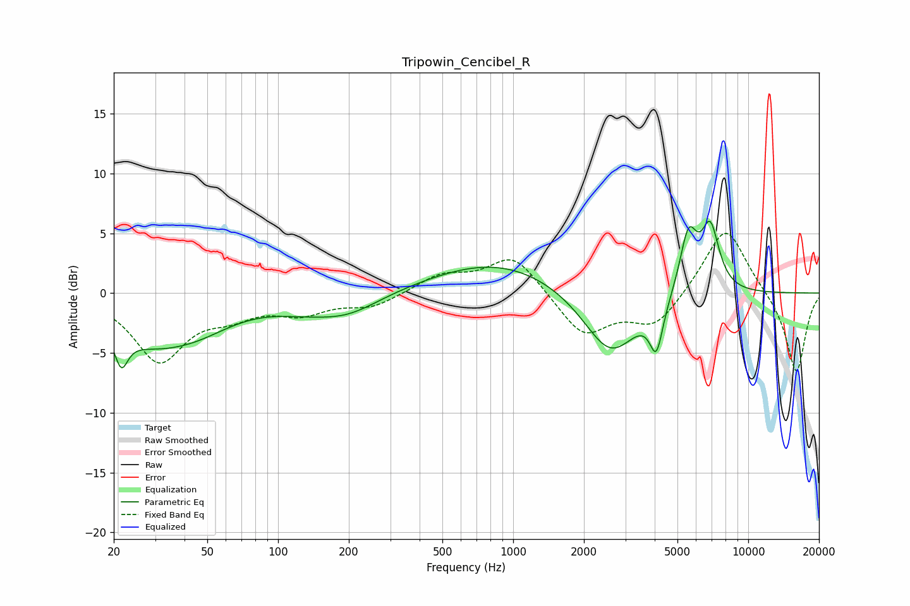

# Tripowin_Cencibel_R
See [usage instructions](https://github.com/jaakkopasanen/AutoEq#usage) for more options and info.

### Parametric EQs
Apply preamp of -6.1 dB when using parametric equalizer.

|   # | Type    |   Fc (Hz) |    Q |   Gain (dB) |
|-----|---------|-----------|------|-------------|
|   1 | Peaking |        22 | 5.19 |        -2.7 |
|   2 | Peaking |        28 | 0.74 |        -3.3 |
|   3 | Peaking |        45 | 0.85 |        -1.7 |
|   4 | Peaking |       129 | 0.97 |        -0.7 |
|   5 | Peaking |       198 | 0.99 |        -1.6 |
|   6 | Peaking |       861 | 0.5  |         2.7 |
|   7 | Peaking |      2600 | 1.2  |        -5.5 |
|   8 | Peaking |      4068 | 4.98 |        -3.9 |
|   9 | Peaking |      5570 | 3.67 |         5.2 |
|  10 | Peaking |      6894 | 3.53 |         5.3 |

### Fixed Band EQs
When using fixed band (also called graphic) equalizer, apply preamp of **-5.1 dB** (if available) and set gains manually with these parameters.

|   # | Type    |   Fc (Hz) |    Q |   Gain (dB) |
|-----|---------|-----------|------|-------------|
|   1 | Peaking |        31 | 1.41 |        -5.5 |
|   2 | Peaking |        62 | 1.41 |        -1.4 |
|   3 | Peaking |       125 | 1.41 |        -1.5 |
|   4 | Peaking |       250 | 1.41 |        -1.1 |
|   5 | Peaking |       500 | 1.41 |         1.4 |
|   6 | Peaking |      1000 | 1.41 |         3.2 |
|   7 | Peaking |      2000 | 1.41 |        -3.6 |
|   8 | Peaking |      4000 | 1.41 |        -2.8 |
|   9 | Peaking |      8000 | 1.41 |         5.8 |
|  10 | Peaking |     16000 | 1.41 |        -6.8 |

### Graphs

