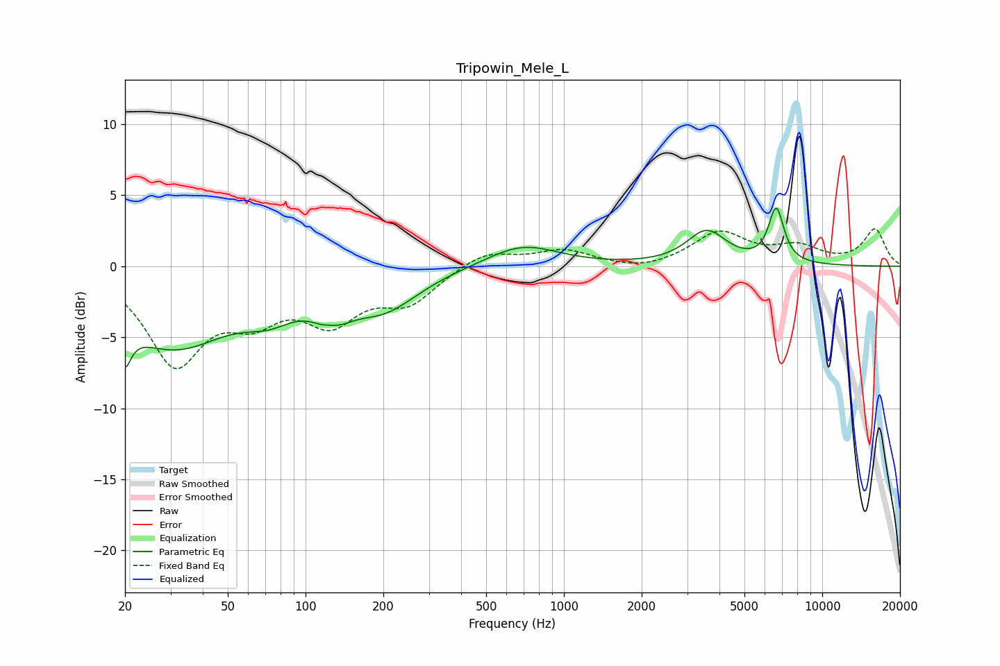

# Tripowin_Mele_L
See [usage instructions](https://github.com/jaakkopasanen/AutoEq#usage) for more options and info.

### Parametric EQs
Apply preamp of -4.2 dB when using parametric equalizer.

|   # | Type    |   Fc (Hz) |    Q |   Gain (dB) |
|-----|---------|-----------|------|-------------|
|   1 | Peaking |        20 | 5.85 |        -6.1 |
|   2 | Peaking |        20 | 5.97 |         3.3 |
|   3 | Peaking |        31 | 0.63 |        -5.5 |
|   4 | Peaking |        73 | 1.37 |        -1.6 |
|   5 | Peaking |       126 | 3.11 |         2.5 |
|   6 | Peaking |       126 | 2.5  |        -4.1 |
|   7 | Peaking |       200 | 1.03 |        -2.7 |
|   8 | Peaking |       692 | 1.03 |         1.6 |
|   9 | Peaking |      3567 | 1.85 |         2.4 |
|  10 | Peaking |      6637 | 4.61 |         3.8 |

### Fixed Band EQs
When using fixed band (also called graphic) equalizer, apply preamp of **-2.7 dB** (if available) and set gains manually with these parameters.

|   # | Type    |   Fc (Hz) |    Q |   Gain (dB) |
|-----|---------|-----------|------|-------------|
|   1 | Peaking |        31 | 1.41 |        -6.5 |
|   2 | Peaking |        62 | 1.41 |        -2.8 |
|   3 | Peaking |       125 | 1.41 |        -3.4 |
|   4 | Peaking |       250 | 1.41 |        -2.3 |
|   5 | Peaking |       500 | 1.41 |         1.1 |
|   6 | Peaking |      1000 | 1.41 |         1.1 |
|   7 | Peaking |      2000 | 1.41 |        -0.4 |
|   8 | Peaking |      4000 | 1.41 |         2.3 |
|   9 | Peaking |      8000 | 1.41 |         1.2 |
|  10 | Peaking |     16000 | 1.41 |         2.6 |

### Graphs

