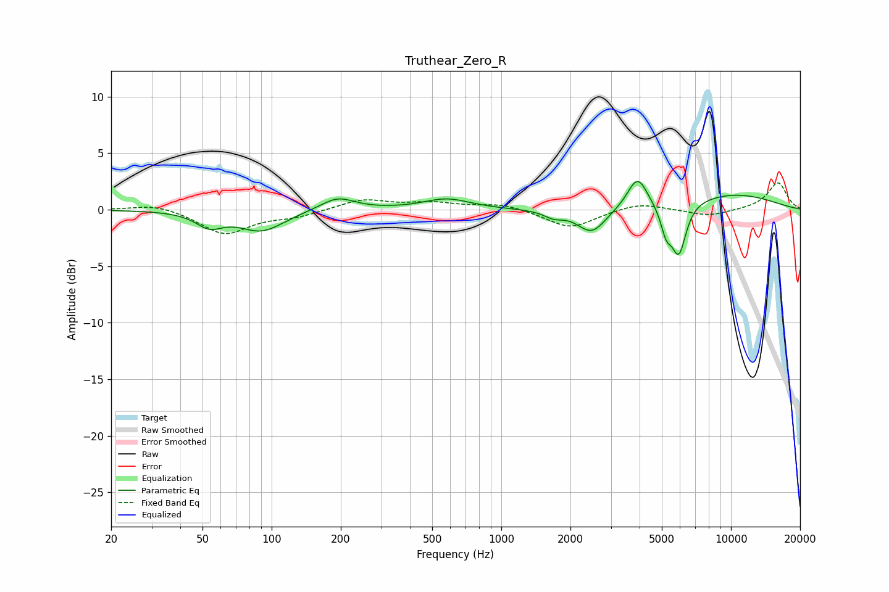

# Truthear_Zero_R
See [usage instructions](https://github.com/jaakkopasanen/AutoEq#usage) for more options and info.

### Parametric EQs
Apply preamp of -2.6 dB when using parametric equalizer.

|   # | Type    |   Fc (Hz) |    Q |   Gain (dB) |
|-----|---------|-----------|------|-------------|
|   1 | Peaking |        54 | 2.48 |        -1.2 |
|   2 | Peaking |        90 | 1.44 |        -1.8 |
|   3 | Peaking |       194 | 1.9  |         1.2 |
|   4 | Peaking |       579 | 1.38 |         1   |
|   5 | Peaking |      1689 | 3.43 |        -0.5 |
|   6 | Peaking |      2476 | 2.27 |        -2.2 |
|   7 | Peaking |      3919 | 3.19 |         2.8 |
|   8 | Peaking |      5225 | 5.75 |        -2.1 |
|   9 | Peaking |      5932 | 4.36 |        -4.4 |
|  10 | Peaking |     10000 | 0.55 |         1.4 |

### Fixed Band EQs
When using fixed band (also called graphic) equalizer, apply preamp of **-2.5 dB** (if available) and set gains manually with these parameters.

|   # | Type    |   Fc (Hz) |    Q |   Gain (dB) |
|-----|---------|-----------|------|-------------|
|   1 | Peaking |        31 | 1.41 |         0.6 |
|   2 | Peaking |        62 | 1.41 |        -2.1 |
|   3 | Peaking |       125 | 1.41 |        -0.5 |
|   4 | Peaking |       250 | 1.41 |         0.9 |
|   5 | Peaking |       500 | 1.41 |         0.5 |
|   6 | Peaking |      1000 | 1.41 |         0.5 |
|   7 | Peaking |      2000 | 1.41 |        -1.7 |
|   8 | Peaking |      4000 | 1.41 |         0.7 |
|   9 | Peaking |      8000 | 1.41 |        -0.6 |
|  10 | Peaking |     16000 | 1.41 |         2.4 |

### Graphs

