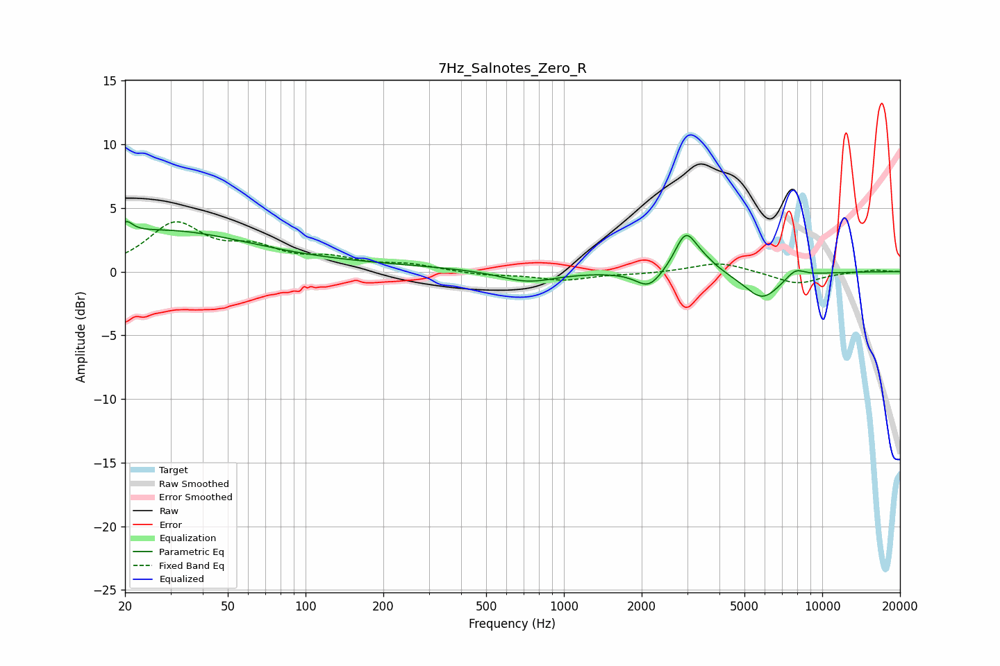

# 7Hz_Salnotes_Zero_R
See [usage instructions](https://github.com/jaakkopasanen/AutoEq#usage) for more options and info.

### Parametric EQs
Apply preamp of -4.0 dB when using parametric equalizer.

|   # | Type    |   Fc (Hz) |    Q |   Gain (dB) |
|-----|---------|-----------|------|-------------|
|   1 | Peaking |        20 | 5.9  |         3   |
|   2 | Peaking |        20 | 6    |        -2.1 |
|   3 | Peaking |        27 | 0.42 |         2.7 |
|   4 | Peaking |        73 | 0.18 |         0.6 |
|   5 | Peaking |       724 | 1.32 |        -0.9 |
|   6 | Peaking |      2132 | 2.83 |        -1.4 |
|   7 | Peaking |      2956 | 3.38 |         2.9 |
|   8 | Peaking |      3450 | 2.58 |         0.7 |
|   9 | Peaking |      5855 | 1.94 |        -2.2 |
|  10 | Peaking |      7868 | 3.68 |         0.7 |

### Fixed Band EQs
When using fixed band (also called graphic) equalizer, apply preamp of **-4.0 dB** (if available) and set gains manually with these parameters.

|   # | Type    |   Fc (Hz) |    Q |   Gain (dB) |
|-----|---------|-----------|------|-------------|
|   1 | Peaking |        31 | 1.41 |         3.6 |
|   2 | Peaking |        62 | 1.41 |         1.5 |
|   3 | Peaking |       125 | 1.41 |         0.8 |
|   4 | Peaking |       250 | 1.41 |         0.5 |
|   5 | Peaking |       500 | 1.41 |        -0.3 |
|   6 | Peaking |      1000 | 1.41 |        -0.6 |
|   7 | Peaking |      2000 | 1.41 |        -0.1 |
|   8 | Peaking |      4000 | 1.41 |         0.8 |
|   9 | Peaking |      8000 | 1.41 |        -1   |
|  10 | Peaking |     16000 | 1.41 |         0.2 |

### Graphs

